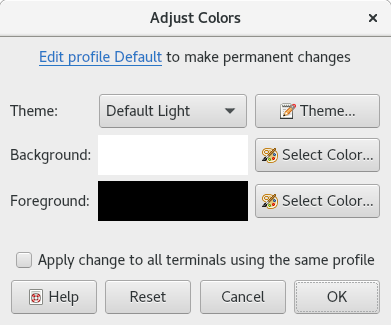
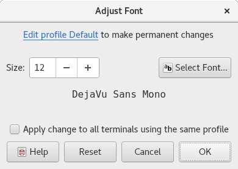
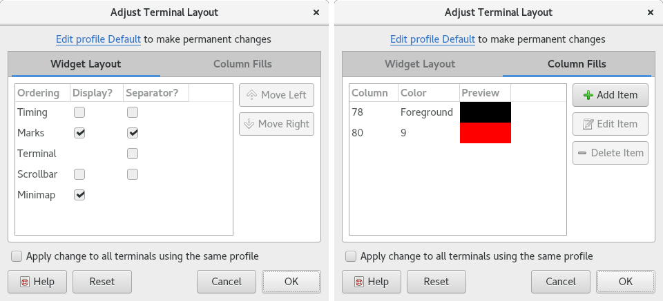
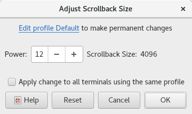

.. Copyright © 2018 TermySequence LLC
.. SPDX-License-Identifier: CC-BY-SA-4.0

Adjustment Dialogs
==================

The Adjustment Dialogs are used to change settings in individual terminals, overriding the settings from the terminal's :doc:`profile <../settings/profile>`.

.. contents::
   :local:

.. _adjust-colors:

Adjust Colors
-------------

The Adjust Colors dialog is used to change the :term:`active terminal`'s color palette, overriding the :termy:profile:`Palette <Appearance/Palette>` and :termy:profile:`Dircolors <Files/Dircolors>` set in the terminal's :doc:`profile <../settings/profile>`. Access the dialog using View→Adjust Colors, various context menus, or the :termy:action:`AdjustTerminalColors` action. See :doc:`Theme Editor dialog <theme-editor>` for information on the detailed theme editor which can be launched from this dialog.

Changes made within the dialog take effect immediately and will be visible in the active terminal. The dialog is not modal, allowing the terminal to be used while it is open. Canceling the dialog will revert all changes. To undo changes made using the dialog, use the Reset button, View→Undo All Adjustments, :termy:action:`UndoAllAdjustments` action, or switch the terminal to another profile and back.

.. note:: If the active terminal is :termy:action:`owned <TakeTerminalOwnership>` by another client and :termy:profile:`ShowRemoteColors <Collaboration/ShowRemoteColors>` is enabled in the terminal's profile, color changes made by the owning client will override changes made using this dialog. To avoid this, disable :termy:profile:`ShowRemoteColors <Collaboration/ShowRemoteColors>` or switch to a profile that has it disabled.

.. _adjust-colors-example:

   Example Adjust Colors dialog.

The dialog has the following elements:

   Edit profile to make permanent changes
      A reminder that changes made in the dialog are not saved to any :doc:`profile <../settings/profile>`. Click the link to edit the terminal's profile instead. The relevant settings within the profile are :termy:profile:`Appearance/Palette` and :termy:profile:`Files/Dircolors`.

   Theme
      The name of the :doc:`theme <../settings/theme>` that matches the terminal's current color theme. If there is no matching theme, "<Custom Color Theme>" is displayed instead. Select a theme from the dropdown menu or click the button to bring up the :doc:`Theme Editor dialog <theme-editor>` to make custom edits.

   Background
      Quickly change the terminal's :ref:`primary background color <theme-editor-extended>`. The current background color is shown. Click Select Color to bring up a `color selection dialog <http://doc.qt.io/qt-5/qcolordialog.html>`_.

   Foreground
      Quickly change the terminal's :ref:`primary foreground color <theme-editor-extended>`. The current foreground color is shown. Click Select Color to bring up a `color selection dialog <http://doc.qt.io/qt-5/qcolordialog.html>`_.

   Apply change to all terminals using the same profile
      If checked, the changes made in the dialog will be propagated to all other terminals using the same :doc:`profile <../settings/profile>` as the :term:`active terminal`. Other terminals will be updated when the dialog is accepted.

   Reset
      Changes the color theme back to the one defined in the terminal's profile.

.. _adjust-font:

Adjust Font
-----------

The Adjust Font dialog is used to change the :term:`active terminal`'s font, overriding the :termy:profile:`Font <Appearance/Font>` set in the terminal's :doc:`profile <../settings/profile>`. Access the dialog using View→Adjust Font, various context menus, or the :termy:action:`AdjustTerminalFont` action. Font size can be adjusted directly using View→Increase Font, View→Decrease Font, :termy:action:`IncreaseFont`, or :termy:action:`DecreaseFont`.

.. tip:: Use :ref:`presentation mode <global-presentation-mode>` instead of this dialog to quickly set up for a presentation on a large display. The :termy:global:`FontSizeIncrement <Presentation/FontSizeIncrement>` setting can be used to increase the font size when entering presentation mode via View→Presentation Mode or :termy:action:`TogglePresentationMode`.

Fonts used in terminals must be fixed width (also called typewriter or monospace). :program:`qtermy` uses Qt's `QFont <http://doc.qt.io/qt-5/qfont.html>`_ and related classes to handle font loading. In general, fonts are matched using "best effort" algorithm that may choose a different font if the requested font in the requested size is not found.

Changes made within the dialog take effect immediately and will be visible in the active terminal. The dialog is not modal, allowing the terminal to be used while it is open. Canceling the dialog will revert all changes. To undo changes made using the dialog, use the Reset button, View→Undo All Adjustments, :termy:action:`UndoAllAdjustments` action, or switch the terminal to another profile and back.

.. note:: If the active terminal is :termy:action:`owned <TakeTerminalOwnership>` by another client and :termy:profile:`ShowRemoteFont <Collaboration/ShowRemoteFont>` is enabled in the terminal's profile, font changes made by the owning client will override changes made using this dialog. To avoid this, disable :termy:profile:`ShowRemoteFont <Collaboration/ShowRemoteFont>` or switch to a profile that has it disabled.

.. _adjust-font-example:

   Example Adjust Font dialog.

The dialog has the following elements:

   Edit profile to make permanent changes
      A reminder that changes made in the dialog are not saved to any :doc:`profile <../settings/profile>`. Click the link to edit the terminal's profile instead. The relevant setting within the profile is :termy:profile:`Appearance/Font`.

   Size
      Quickly adjust the font size without changing the font itself. Size is specified in points.

   Select Font
       Click Select Font to bring up a `font selection dialog <http://doc.qt.io/qt-5/qfontdialog.html>`_. The name of the current font is shown in the preview area.

   Apply change to all terminals using the same profile
      If checked, the changes made in the dialog will be propagated to all other terminals using the same :doc:`profile <../settings/profile>` as the :term:`active terminal`. Other terminals will be updated when the dialog is accepted.

   Reset
      Changes the font back to the one defined in the terminal's profile.

.. _adjust-layout:

Adjust Layout
-------------

The Adjust Layout dialog is used to change the :term:`active terminal`'s :doc:`widget <../widgets>` layout and column fills, overriding the :termy:profile:`WidgetLayout <Appearance/WidgetLayout>` and :termy:profile:`ColumnFills <Appearance/ColumnFills>` set in the terminal's :doc:`profile <../settings/profile>`. Access the dialog using View→Adjust Layout, various context menus, or the :termy:action:`AdjustTerminalLayout` action.

Changes made within the dialog take effect immediately and will be visible in the active terminal. The dialog is not modal, allowing the terminal to be used while it is open. Canceling the dialog will revert all changes. To undo changes made using the dialog, use the Reset button, View→Undo All Adjustments, :termy:action:`UndoAllAdjustments` action, or switch the terminal to another profile and back.

.. note:: If the active terminal is :termy:action:`owned <TakeTerminalOwnership>` by another client and :termy:profile:`ShowRemoteLayout <Collaboration/ShowRemoteLayout>` or :termy:profile:`ShowRemoteFills <Collaboration/ShowRemoteFills>` are enabled in the terminal's profile, changes made by the owning client will override changes made using this dialog. To avoid this, disable :termy:profile:`ShowRemoteLayout <Collaboration/ShowRemoteLayout>` and/or :termy:profile:`ShowRemoteFills <Collaboration/ShowRemoteFills>` or switch to a profile that has them disabled.

.. _adjust-layout-example:

   Example Adjust Layout dialog.

The dialog has the following elements:

   Edit profile to make permanent changes
      A reminder that changes made in the dialog are not saved to any :doc:`profile <../settings/profile>`. Click the link to edit the terminal's profile instead. The relevant settings within the profile are :termy:profile:`Appearance/WidgetLayout` and :termy:profile:`Appearance/ColumnFills`.

   Widget Layout
      Change the ordering of the terminal :doc:`Widgets <../widgets>` and whether each widget is followed by a separator line. Click Move Up and Move Down to reorder widgets.

   Column Fills
      Add, remove, and modify column fills. Click Add Item to add a new column fill. Specify the column position of the fill and what color it will be drawn in. The fill can either use the terminal's :ref:`primary background color <theme-editor-extended>` or an index into the terminal's :termy:profile:`palette <Appearance/Palette>` between 0 and 255. Click Edit Item to edit the selected fill in the list. Click Delete Item to remove the selected fill from the list.

   Apply change to all terminals using the same profile
      If checked, the changes made in the dialog will be propagated to all other terminals using the same :doc:`profile <../settings/profile>` as the :term:`active terminal`. Other terminals will be updated when the dialog is accepted.

   Reset
      Changes the widget layout and column fills back to the those defined in the terminal's profile.

.. _adjust-scrollback:

Adjust Scrollback
-----------------

The Adjust Scrollback dialog is used to change the size of the :term:`active terminal`'s scrollback buffer, overriding the :termy:profile:`ScrollbackSizePower <Emulator/ScrollbackSizePower>` set in the terminal's :doc:`profile <../settings/profile>`. Access the dialog using Terminal→Scrollback→Adjust Scrollback, various context menus, or the :termy:action:`AdjustTerminalScrollback` action.

Unlike the other :doc:`adjustment dialogs <adjust-dialogs>`, changes made using this dialog are permanent and cannot be undone except by resizing the scrollback buffer again. Reducing the size of the scrollback buffer will cause scrollback buffer contents beyond the new size to be permanently lost. The scrollback buffer will not be resized until the dialog is accepted.

Only the :termy:action:`owner <TakeTerminalOwnership>` of a terminal can change its scrollback buffer size. Requests to do so from other clients will be ignored by :doc:`termy-server <../server>`. Note however that **this is not a security mechanism**, since any client can take ownership of a terminal at any time.

.. _adjust-scrollback-example:

   Example Adjust Scrollback dialog.

The dialog has the following elements:

   Edit profile to make permanent changes
      A reminder that changes made in the dialog are not saved to any :doc:`profile <../settings/profile>`. Click the link to edit the terminal's profile instead. The relevant setting within the profile is :termy:profile:`Emulator/ScrollbackSizePower`.

   Power
      The new scrollback buffer size, which must be a power of 2. Enter the new exponent in the spin box. The scrollback buffer size cannot be smaller than the terminal's screen height; it will be increased to fit if necessary.

   Apply change to all terminals using the same profile
      If checked, the changes made in the dialog will be propagated to all other terminals using the same :doc:`profile <../settings/profile>` as the :term:`active terminal`.

   Reset
      Sets the scrollback size power in the spin box to the terminal's current size.
