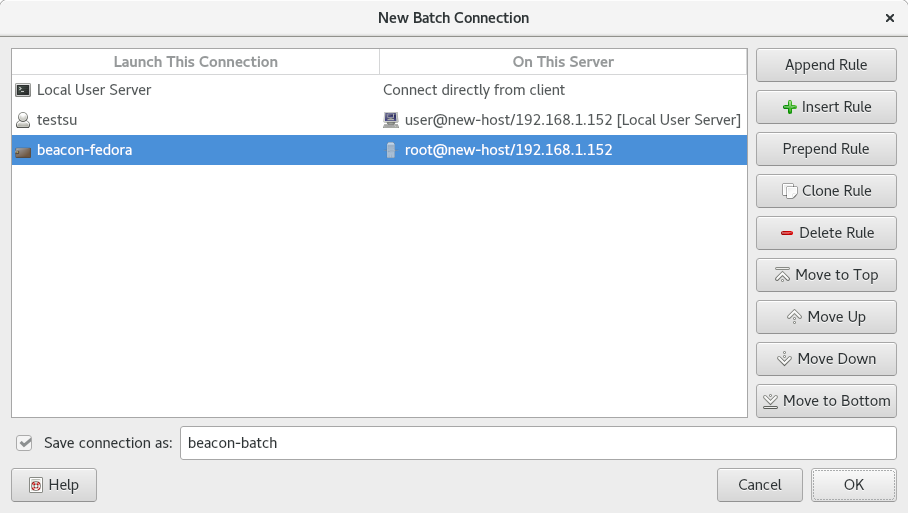

.. Copyright © 2018 TermySequence LLC
.. SPDX-License-Identifier: CC-BY-SA-4.0

Batch Connection
================

A *batch connection* is a special type of :doc:`connection <../settings/connection>` that specifies a list of saved connections to run in sequence. This allows connections to be quickly and easily opened to multiple remote systems across multiple hops. A batch connection can even contain other batch connections.

The :ref:`nearby figure <connect-batch-example>` shows the Batch Connection dialog with an example batch connection. The batch connection contains three connections:

   * The :term:`persistent user server`
   * A :ref:`user connection <connect-user>` to the local root user
   * A :ref:`container connection <connect-container>` to a local container

Each of the latter two connections is run from the server made available by the previous connection in the list. In this way, a TermySequence connection to the container can be established in a single operation.

.. tip:: The connections in a batch connection are not required to depend on each other. In addition to opening connections across multiple hops, a batch connection can be used simply as a means to open many connections at once.

When :termy:action:`opening <OpenConnection>` a batch connection, each connection in the list will be opened in sequence using individual :doc:`tasks <../tools/tasks>`. Connections that are already established will be skipped. A :doc:`connection status dialog <connection-status>` will be shown for each connection to collect passwords if necessary. A :doc:`failed connection <../failed-to-connect>` will stop the sequence.

.. _connect-batch-example:

   Example Batch Connection dialog.

The dialog has the following elements:

   Launch This Connection
      The ordered list of :doc:`connections <../settings/connection>` to open. Click an entry to edit it.

   On This Server
      A read-only column showing each connection's configured :termy:connection:`LaunchFrom <Server/LaunchFrom>` setting as a convenience.

   Append Rule
      Adds a new connection to the end of the list

   Insert Rule
      Inserts a new connection at the location of the selected connection

   Prepend Rule
      Inserts a new connection at the beginning of the list

   Clone Rule
      Duplicates the selected connection in the list

   Delete Rule
      Removes the selected connection from the list

   Move to Top
      Moves the selected connection to the top of the list

   Move Up
      Moves the selected connection up in the list

   Move Down
      Moves the selected connection down in the list

   Move to Bottom
      Moves the selected connection to the bottom of the list

   Apply
      Saves changes made in the dialog. This button is only present when editing a saved connection from the :doc:`Manage Connections window <manage-connections>`.

   Reset
      Discards changes made in the dialog. This button is only present when editing a saved connection.

   Save connection as
      Specify a name to save the connection as. This element is not present when editing a saved connection.
