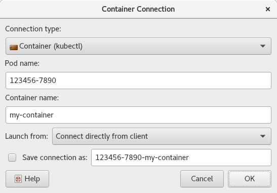

.. Copyright © 2018 TermySequence LLC
.. SPDX-License-Identifier: CC-BY-SA-4.0

New Connection Dialogs
======================

The New Connection Dialogs provide a convenient way to create a :doc:`connection <../settings/connection>` using one of several programs commonly used for this purpose. Each dialog is customized to a particular program, making it easier to use than the :doc:`settings editor dialog <settings-editor>` normally used to edit connections from the :doc:`Manage Connections window <manage-connections>`.

.. contents::
   :local:

.. _connect-ssh:

SSH Connection
--------------

The SSH Connection dialog provides a convenient way to create a :doc:`connection <../settings/connection>` to a container using :manpage:`ssh(1)`.

The dialog will create a connection using a default SSH :termy:connection:`Command <Connection/Command>`. For more control over the connection and its command, edit the connection from the :doc:`Manage Connections window <manage-connections>` or create a :ref:`custom connection <connect-custom>`.

Refer to the documentation for the :termy:action:`NewConnection` action and its :termy:param:`ConnArg` parameter for more information. See :doc:`termy-ssh <../man/ssh>` for a way to make connections independently of :program:`qtermy`.

.. important:: Make sure that :doc:`termy-server <../man/server>`\ (1) is installed on the remote system and present on the remote user's :envvar:`PATH`. The shell run by :manpage:`ssh(1)` in single command mode is neither a login shell nor interactive, meaning that the remote user's :file:`.profile` and :file:`.bash_profile` will not be sourced. Furthermore, :envvar:`PATH` customizations applied in the remote user's :file:`.bashrc` must be made before any test for interactivity that causes the script to exit.

   Refer to :doc:`../failed-to-connect` for more on the particulars of SSH, bash, and :envvar:`PATH`.

.. _connect-ssh-example:

.. figure:: ../images/connect-ssh.png
   :alt: Picture of SSH Connection dialog.
   :align: center

   Example SSH Connection dialog.

The dialog has the following elements:

   User\@host destination
      Specify the SSH destination. The username portion may be omitted if it's configured in the SSH :file:`config` or identical to the local username.

   Optional additional SSH arguments
      Additional arguments to the SSH command. This can include option settings using ``-o`` or other switches. Note that shell constructs such as quoting and variable expansion should not be used since the command may not be run by a shell. Complex SSH commands may require use of a wrapper script or "Other/Generic" connection instead of this dialog.

      .. important:: Ensure that no options such as ``-v`` are set which might disrupt the protocol stream. Refer to :termy:connection:`UseRawProtocol <Connection/UseRawProtocol>` for more information.

   Use binary protocol encoding
      Enables the :termy:connection:`UseRawProtocol <Connection/UseRawProtocol>` connection setting. The ``-q`` switch is added to the command to prevent diagnostic messages from disrupting the protocol stream. This is the default.

   Allocate a local pty for password prompts
      Enables the :termy:connection:`UseLocalPty <Connection/UseLocalPty>` connection setting. This is the default, but it can be disabled if you are sure that no prompts will be displayed. Note that the ``-T`` option is always used to disable allocation of a *remote* pty along with tilde escapes.

   .. include:: connect-common.rst

.. _connect-user:

User Connection
---------------

The User Connection dialog provides a convenient way to create a :doc:`connection <../settings/connection>` to another user's :term:`persistent user server` using a few popular programs such as :manpage:`sudo(8)`.

The dialog will create a connection using a default :termy:connection:`Command <Connection/Command>` for each supported program. For more control over the connection and its command, edit the connection from the :doc:`Manage Connections window <manage-connections>` or create a :ref:`custom connection <connect-custom>`.

Refer to the documentation for the :termy:action:`NewConnection` action and its :termy:param:`ConnArg` parameter for more information. See :doc:`termy-sudo <../man/sudo>`, :doc:`termy-su <../man/su>`, and :doc:`termy-connect <../man/connect>` for a way to make connections independently of :program:`qtermy`.

.. note:: The dialog picks values for the :termy:connection:`UseRawProtocol <Connection/UseRawProtocol>` and :termy:connection:`UseLocalPty <Connection/UseLocalPty>` connection settings which have been observed to work for each command. It's possible that these settings may need to be changed from system to system. Refer to :doc:`../failed-to-connect` for more information.

.. _connect-user-example:

   Example User Connection dialog.

The dialog has the following elements:

   Connection type
      Select the desired program from the dropdown. This program must be installed on the target system and the user running the command must be permitted to use it, for example via :manpage:`sudoers(5)`.

      Make sure that the :doc:`termy-server <../server>` executable is on the target user's :envvar:`PATH` and can be launched by the program.

   Username
      Specify the username to switch to using the command.

   .. include:: connect-common.rst

.. _connect-container:

Container Connection
--------------------

The Container Connection dialog provides a convenient way to create a :doc:`connection <../settings/connection>` to a container using a few popular container runtimes.

The dialog will create a connection using a default :termy:connection:`Command <Connection/Command>` for each supported container runtime. For more control over the connection and its command, edit the connection from the :doc:`Manage Connections window <manage-connections>` or create a :ref:`custom connection <connect-custom>`.

Refer to the documentation for the :termy:action:`NewConnection` action and its :termy:param:`ConnArg` parameter for more information. See :doc:`termy-connect <../man/connect>` for a way to make connections independently of :program:`qtermy`.

.. _connect-container-example:

   Example Container Connection dialog.

The dialog has the following elements:

   Connection type
      Select the desired container runtime from the dropdown.

   Pod name
      For container runtimes which group individual containers into logical "pods," the identifier of the pod to connect to.

   Container name
      The name of the container to connect to. This may be optional depending on the container runtime.

   .. include:: connect-common.rst

.. _connect-custom:

Custom Connection
-----------------

The Custom Connection dialog provides a way to create a :doc:`connection <../settings/connection>` with full control over the most commonly customized settings.

For even more control over the connection, edit it from the :doc:`Manage Connections window <manage-connections>`. See :doc:`termy-connect <../man/connect>` for a way to make connections independently of :program:`qtermy`.

.. _connect-custom-example:

   Example Custom Connection dialog.

The dialog has the following elements:

   Command to run termy-server on the target system
      The connection's :termy:connection:`Command <Connection/Command>`. It will be split on whitespace and the first word will be used as both the executable to run and argument zero of the argument vector. For more control over the argument vector, edit the connection from the :doc:`Manage Connections window <manage-connections>`.

      Note that shell constructs such as quoting and variable expansion should not be used since the command may not be run by a shell. Use a wrapper script if this is required.

   Use binary protocol encoding
      Enables the :termy:connection:`UseRawProtocol <Connection/UseRawProtocol>` connection setting.

   Allocate a local pty for password prompts
      Enables the :termy:connection:`UseLocalPty <Connection/UseLocalPty>` connection setting.

   Keep-alive timeout
      Sets the :termy:connection:`KeepaliveTime <Connection/KeepaliveTime>` connection setting.

   .. include:: connect-common.rst
