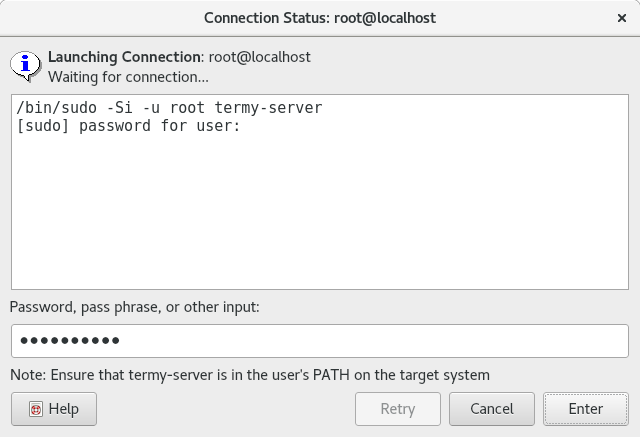

.. Copyright © 2018 TermySequence LLC
.. SPDX-License-Identifier: CC-BY-SA-4.0

Connection Status
=================

The Connection Status dialog is automatically shown when a :doc:`connection <../settings/connection>` is being :termy:action:`opened <OpenConnection>` and any of the following occur:

   * Output is printed by the connection's :termy:connection:`Command <Connection/Command>`.
   * A brief timeout has passed and the connection is still ongoing.
   * The connection has :doc:`failed <../failed-to-connect>`.

The dialog will automatically close when the connection succeeds.

.. _connection-status-example:

   Example Connection Status dialog.

The dialog has the following elements:

   Command Output
      Displays the connection's :termy:connection:`Command <Connection/Command>` itself, followed by any output printed by the command. This usually consists of prompts and error messages.

      The string ``****`` is displayed as a placeholder when input is submitted.

   Password, pass phrase, or other input
      Text entered here will be sent to the command on its standard input when Return is pressed or the Enter button is clicked.

   Enter
      Submits the contents of the input text field to the command.

   Retry
      Click to retry a failed connection.

   Cancel
      Cancels the connection and closes the dialog.
