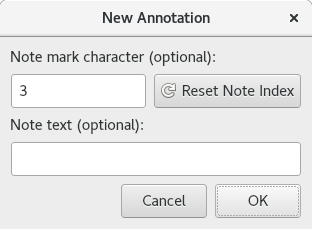

.. Copyright © 2018 TermySequence LLC
.. SPDX-License-Identifier: CC-BY-SA-4.0

Create Annotation
=================

The Create Annotation dialog is used to create an :term:`annotation` on a region of text in the terminal scrollback. Use the :doc:`Annotations tool <../tools/annotations>` to view and manage annotations.

Annotations are immutable once created. To change the text, character, or bounds of an existing annotation, remove it and create a new one.

.. _create-annotation-example:

   Example Create Annotation dialog.

The dialog has the following elements:

   Note mark character
      Specify a single Latin-1 character to attach to the annotation as the ``char`` :term:`attribute`. This will be visible to all users. It will be shown on the annotation's mark within the :ref:`Marks <marks-widget>` and :ref:`Minimap <minimap-widget>` widgets. The default value is a number that increments each time an annotation is added to a given terminal. Click Reset Note Index to reset the number to 1 in the terminal.

   Note text
      Specify text to attach to the annotation as the ``text`` :term:`attribute`. This will be visible to all users. It will be shown in the :doc:`Annotations tool <../tools/annotations>` and in tooltips.
