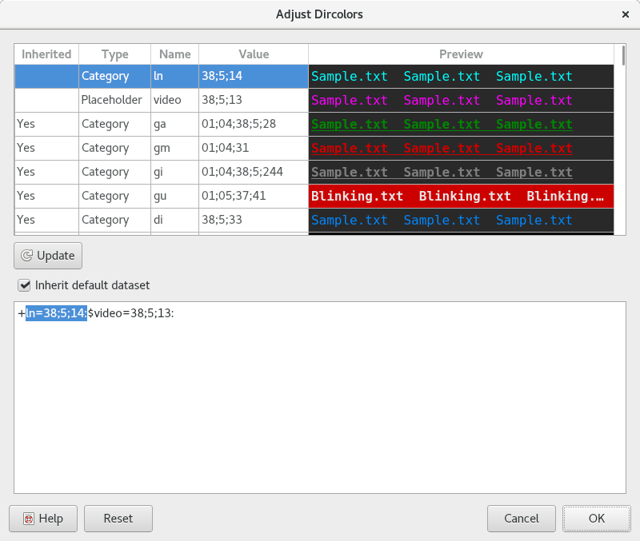

.. Copyright © 2018 TermySequence LLC
.. SPDX-License-Identifier: CC-BY-SA-4.0

Dircolors Editor
================

The Dircolors Editor dialog is shown when editing the :termy:profile:`Files/Dircolors` profile setting. It is equivalent to the Dircolors tab in the :doc:`Theme Editor dialog <theme-editor>`.

Changes made within the dialog take effect immediately and will be visible in the :doc:`Files tool <../tools/files>` for the affected terminal or terminals. Canceling the dialog will revert all changes. To undo changes made using the dialog without closing it, use the Reset button.

.. note:: This dialog will not affect the :envvar:`LS_COLORS` environment variable used by :manpage:`ls(1)` within terminals that are already running. Refer to the :termy:profile:`SetLsColorsEnvironmentVariable <Files/SetLsColorsEnvironmentVariable>` profile setting.

.. _dircolors-editor-extended:

The dircolors setting itself consists of a string in :manpage:`dircolors(1)` format with some :program:`qtermy` extensions. These extensions are:

   * A leading plus sign (+) indicates that the compiled-in default dircolors should be inherited. Entries defined by the string will override inherited entries.
   * A completely empty string also inherits the compiled-in default dircolors. To specify no dircolors whatsoever, use the string ``rs=0``.
   * The categories ``ga``, ``gm``, ``gi``, and ``gu`` specify the colors used by the :termy:profile:`git status characters <Files/FileGittify>` in the :doc:`Files tool <../tools/files>` for added, modified, ignored, and unmerged (conflict) files respectively.
   * It's possible to define named *placeholders* using the specifier syntax ``$name=value``. The value can then be substituted into file glob entries using the syntax ``*.ext=name``. The compiled-in default dircolors uses the placeholders ``audio``, ``video``, and ``archive`` for all file glob entries. These can be overridden by redefining them.

:program:`qtermy`'s dircolors implementation has the following limitations:

   * File glob entries must be of the form ``*.extension``.
   * The categories ``rs`` (regular file) and ``mh`` (multiple hard links) are not supported and will be treated as a no-op if defined.
   * A non-empty dircolors string must end in a colon (:) character.

.. _dircolors-editor-example-1:

   Example Dircolors Editor dialog.

The dialog has the following elements:

   Table View
      A list of all dircolors entries, including inherited entries. Click a (non-inherited) entry to select its text within the dircolors string. Double-click an entry to paste its text at the end of the dircolors string.

   Inherited
      Whether each dircolors entry is inherited from the default compiled-in dircolors. Non-inherited entries appear first in the list.

   Type
      The type of each dircolors entry: one of placeholder, category, or extension.

   Name
      The name portion of each dircolors entry.

   Value
      The value portion of each dircolors entry.

   Preview
      A preview of each dircolors entry's text. Blinking text does not blink in the preview, but does blink in the :doc:`Files tool <../tools/files>`.

   Update
      Parses changes to the dircolors string, updating the table if successful.

   Inherit default dataset
      A convenience check box which removes or adds the plus sign (+) at the beginning of the dircolors string indicating that the compiled-in default dircolors should be inherited. Note that a completely empty string is considered to inherit the compiled-in default dircolors.

   Dircolors string
      The raw dircolors string. Make edits here, then click the Update button to update the table.

      The string should not contain newlines or other whitespace. A non-empty string must end in a colon (:) character.

   Reset
      Discards changes made in the dialog.
