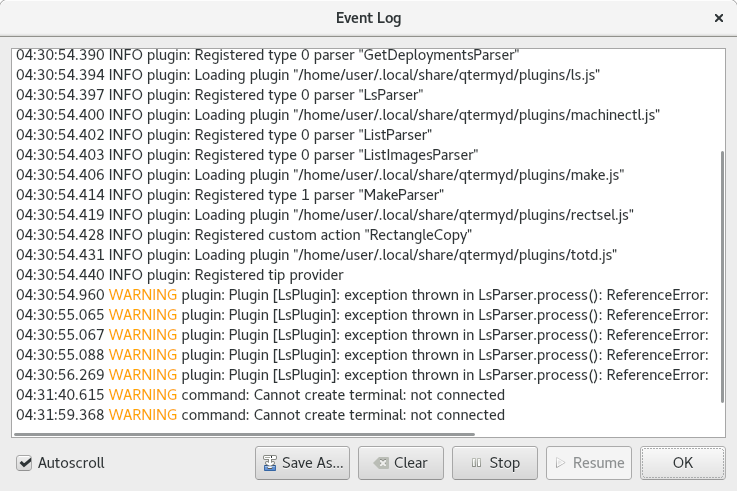

.. Copyright © 2018 TermySequence LLC
.. SPDX-License-Identifier: CC-BY-SA-4.0

Event Log
=========

.. highlight:: none

The Event Log window displays log messages produced by the application. To access this window, use Help→Event Log or the :termy:action:`EventLog` action.

`Qt's logging system <http://doc.qt.io/qt-5/qloggingcategory.html>`_ is used to handle logging. A `custom message handler <http://doc.qt.io/qt-5/qtglobal.html#qInstallMessageHandler>`_ is installed to capture messages for display in the Event Log window. Only messages produced by :program:`qtermy` itself under the following logging categories will be displayed:

   * *plugin*: Messages related to :doc:`plugins <../plugins/index>`, including log messages produced by plugins using :js:data:`console` methods
   * *command*: Messages related to wire communications with :doc:`termy-server <../server>`
   * *keymap*: Messages related to :doc:`keymap <../settings/keymap>` parsing
   * *settings*: Messages related to :doc:`settings objects <../settings/index>`, and for other purposes
   * *layout*: Messages related to window and widget layout (only used in debug mode)
   * *terminal*: Messages related to terminal :termy:global:`scrollback fetch <Server/ScrollbackFetchSpeed>` (only used in debug mode)

The Event Log window can be automatically shown whenever a log message at the "warning" severity level or higher is printed. This is configured via the :termy:global:`LogThreshold <Global/LogThreshold>` global setting.

If the :termy:global:`LogToSystem <Global/LogToSystem>` global setting is enabled, log messages will also be copied to Qt's default logging handler which prints them on standard output.

Log messages can be enabled and disabled on a per-category basis by creating a `logging rules file <http://doc.qt.io/qt-5/qloggingcategory.html#configuring-categories>`_ at :file:`{$HOME}/.config/QtProject/qtlogging.ini`. For example, the following snippet will disable plugin messages at the info level::

   [Rules]
   app.qtermy.plugin.info=false

.. _event-log-example:

   Example Event Log window.

The window has the following elements:

   Main Text Area
      Displays log messages that have passed the logging filter as described above. Each message entry contains the following, separated by spaces:

         * A timestamp
         * The severity level of the message in all caps
         * The category of the message followed by a colon (:)
         * The message itself

   Autoscroll
      Whether to scroll the text area as new log messages are received

   Save As
      Click to save the contents of the text area to a text file

   Clear
      Clears the text area, removing all log messages

   Stop
      Stops appending log messages to the text area as they are received. Messages received while in this state will be lost (but may still be printed by the default logging handler as described above).

   Resume
      Resumes appending log messages to the text area as they are received
