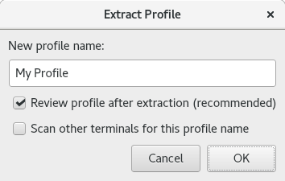

.. Copyright © 2018 TermySequence LLC
.. SPDX-License-Identifier: CC-BY-SA-4.0

Extract Profile
===============

The Extract Profile dialog is used to create a new :doc:`profile <../settings/profile>` from a terminal. This is possible because :program:`qtermy` exports all profile settings as terminal :term:`attributes <attribute>`. The use case for profile extraction is creating a profile from a terminal :termy:action:`owned <TakeTerminalOwnership>` by another :program:`qtermy` user. :ref:`Collaboration settings <profile-collaboration>` allow remote users' visual settings to be honored. If you see a remote user's terminal whose appearance you like, extract a profile from it to get the same settings.

Once the new profile has been extracted, the terminal will be switched to it.

.. _extract-profile-example:

   Example Extract Profile dialog.

The dialog has the following elements:

   New profile name
      Specify the name for the new profile. By default, the name specified in the terminal's ``profile`` attribute is used, but this may conflict with an existing profile name. In the event of a conflict, a number in parentheses will be appended to the name. Choosing a better name in this case is recommended.

   Review profile after extraction
      If checked, the profile will be opened in a :doc:`settings editor dialog <settings-editor>` after being created, so that the settings can be reviewed in full. Doing this is recommended.

   Scan other terminals for this profile name
      If checked, all terminals whose ``profile`` attribute matches the new profile name will be switched to the new profile.
