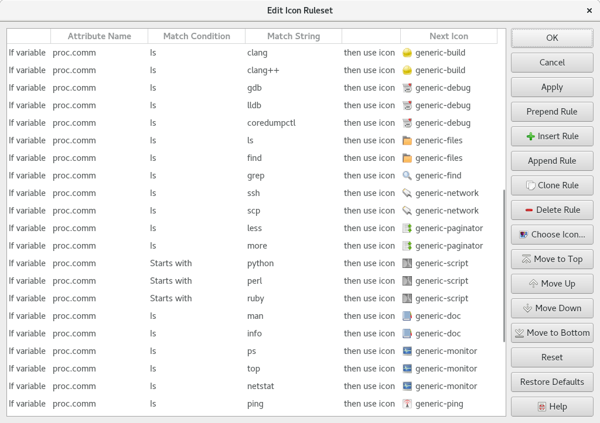

.. Copyright © 2018 TermySequence LLC
.. SPDX-License-Identifier: CC-BY-SA-4.0

Icon Rules Editor
=================

.. highlight:: none

The ruleset managed by the Icon Rules Editor dialog is used to:

   * Determine the terminal thumbnail icon in the :doc:`Terminals tool <../tools/terminals>`, unless the terminal has a fixed icon set using the :termy:profile:`FixedThumbnailIcon <Appearance/FixedThumbnailIcon>` profile setting or :termy:action:`SetTerminalIcon` action, or the terminal's icon is disabled entirely by the :termy:profile:`ShowThumbnailIcon <Appearance/ShowThumbnailIcon>` profile setting.
   * Determine the :term:`job` icons shown in the :doc:`History tool <../tools/history>` and the :ref:`Minimap widget <minimap-widget>`. For this purpose, only rules that match the ``proc.comm`` :term:`attribute` are considered. They are matched against the first word of the job's command.

Rules are processed in order from top to bottom whenever an :term:`attribute` named in any rule changes. The icon name from the first matching rule will be used. If no rule matches or the matching rule's icon is not found, the name "default" is used. The name "none" specifies an empty icon. Icon images are loaded as SVG files from :file:`{$HOME}/.local/share/qtermy/images/command` and :file:`{prefix}/share/qtermy/images/command` in that order.

To access this window, use Settings→Icon Autoswitch Rules or the :termy:action:`EditIconRules` action.

.. _icon-rule-example:

   Example Icon Rules Editor dialog.

The dialog has the following elements:

   Attribute Name
      The name of the terminal :term:`attribute` to match against. Click to edit.

.. _icon-rule-condition:

   Match Condition
      The condition that must be met or not met for the rule to match. All matching is case sensitive. Click to edit.

         * *Is*: The attribute value must equal the match string.
         * *Is set*: The attribute value must be set to any value, including the empty string. The match string is ignored.
         * *Starts with*: The attribute value must start with the match string.
         * *Ends with*: The attribute value must end with the match string.
         * *Contains*: The attribute value must contain the match string at any position.
         * *Matches regex*: The attribute value must match the match string, which is interpreted as an ECMAScript regular expression.

   Match String
      The string or regular expression to match against the attribute value. Click to edit.

   Next Icon
      The icon to display upon a match. Click to edit.

   Prepend Rule
      Inserts a new rule at the beginning of the list

   Insert Rule
      Inserts a new rule at the location of the selected rule

   Append Rule
      Adds a new rule to the end of the list

   Clone Rule
      Duplicates the selected rule in the list

   Delete Rule
      Removes the selected rule from the list

   Choose Icon
      Brings up a separate dialog to choose the icon for the selected rule. The icon can also be changed by clicking in the table.

   Move to Top
      Moves the selected rule to the top of the list

   Move Up
      Moves the selected rule up in the list

   Move Down
      Moves the selected rule down in the list

   Move to Bottom
      Moves the selected rule to the bottom of the list

   Apply
      Saves changes made in the dialog

   Reset
      Discards changes made in the dialog

   Restore Defaults
      Erases all rules and inserts the compiled-in default rules

.. _icon-rule-file:

The icon autoswitch rules are stored at :file:`{$HOME}/.config/qtermy/icon.rules`. Rule definition lines within this file have the following format::

   match_condition "attribute_name" "match_string" "icon_name"

The valid condition types are: ``is``, ``set``, ``startswith``, ``endswith``, ``contains``, and ``regex`` as described under :ref:`Match Condition <icon-rule-condition>` above. Prefix an exclamation mark (!) to the condition type to negate it.

All fields must be present even if they are not used, but unused fields may be empty strings. Blank lines and comment lines starting with a hash mark (#) in the first column are permitted.
