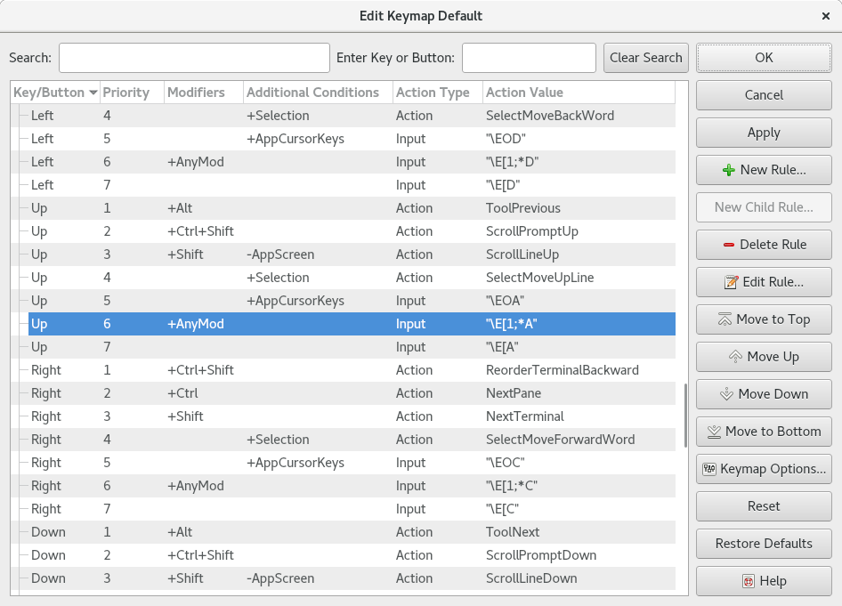
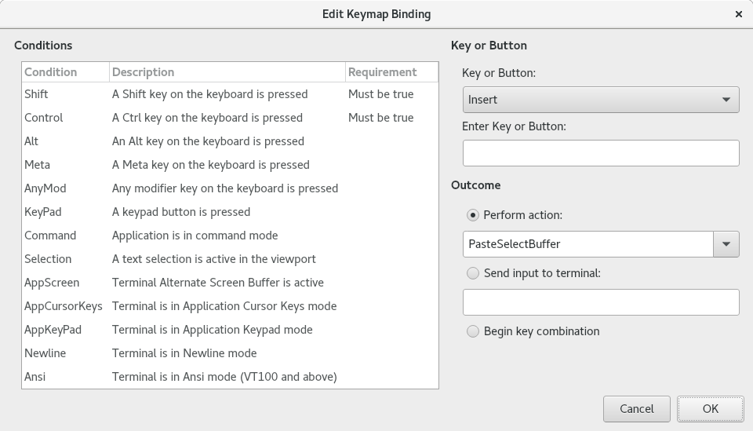

.. Copyright © 2018 TermySequence LLC
.. SPDX-License-Identifier: CC-BY-SA-4.0

Keymap Editor
=============

The Keymap Editor dialog is used to edit the :ref:`bindings <keymap-literal>` and ancillary settings that make up a :doc:`keymap <../settings/keymap>`.

.. _keymap-editor-example:

   Example Keymap Editor dialog.

The dialog has the following elements:

   Main Tree View
      The keymap's :ref:`bindings <keymap-literal>`. Second-level bindings are shown as children of their associated :ref:`digraph opener binding <keymap-digraph>`.

   Search
      Enter a search string to filter the table. The search string will be matched against the key/button, modifiers, additional conditions, action type, and action value of each binding in case-insensitive mode.

   Enter Key or Button
      Focus the input field and enter a keystroke or extended mouse button press. Only bindings matching the key or button will be shown in the table.

   Clear Search
      Removes any search or key/button filtering and displays all bindings in the table.

   Key/Button
      The name of the key or extended mouse button associated with the binding.

   Priority
      The priority of each binding within its key/button group. The lower the number, the higher the priority. When processing a keystroke or button press event, bindings are matched against in ascending order by priority.

   Modifiers
      Each binding's modifier key :ref:`conditions <keymap-modes>`, if any.

   Additional Conditions
      Each binding's :ref:`conditions <keymap-modes>` other than modifier keys, if any.

   Action Type
      Each binding's type: :ref:`literal <keymap-literal>`, :ref:`action <keymap-action>`, or :ref:`digraph <keymap-digraph>`.

   Action Value
      For :ref:`literal bindings <keymap-literal>`, the string to write to the terminal enclosed in double quotes. For :ref:`action bindings <keymap-action>`, the :doc:`action <../actions>` to invoke.

   New Rule
      Creates a new toplevel binding and opens it in the :ref:`Binding Editor dialog <binding-editor>` (described below).

   New Child Rule
      Creates a new second-level binding as a child of the selected digraph opener binding and opens it in the :ref:`Binding Editor dialog <binding-editor>` (described below).

   Delete Rule
      Removes the selected binding. If the selected binding is a digraph opener, all of its children will also be removed.

   Edit Rule
      Opens the selected binding in the :ref:`Binding Editor dialog <binding-editor>` (described below).

   Move to Top
      Moves the selected binding to the top of its key/button group, giving it a priority of 1.

   Move Up
      Moves the selected binding up within its key/button group.

   Move Down
      Moves the selected binding down within its key/button group.

   Move to Bottom
      Moves the selected binding to the bottom of its key/button group.

   Keymap Options
      Opens a dialog box to edit the keymap's :ref:`description <keymap-description>` and :ref:`options <keymap-option>`.

      .. note:: To change a keymap's :ref:`inheritance <keymap-inherit>`, use the Rename Keymap button in the :doc:`Manage Keymaps window <manage-keymaps>`.

   Apply
      Saves changes made in the dialog.

   Reset
      Discards changes made in the dialog.

   Restore Defaults
      Erases all bindings and inserts the compiled-in default bindings. This does not change the keymap's :ref:`description <keymap-description>`, :ref:`options <keymap-option>`, or :ref:`inheritance <keymap-inherit>`.

.. _binding-editor:

The Binding Editor dialog is used to create and edit individual :ref:`bindings <keymap-literal>`.

.. _binding-editor-example:

   Example Binding Editor dialog.

The dialog has the following elements:

   Conditions
      The binding's :ref:`conditions <keymap-modes>`. Click the requirement column to edit. The possible requirements for each condition are positive, negative, or unspecified (always match).

   Key or Button
      Select a key/button from the dropdown list or focus the input field and enter a keystroke or extended mouse button press.

   Outcome
      Specify the binding's type and outcome. For an :ref:`action binding <keymap-action>`, select the :doc:`action <../actions>` to invoke or type an action string into the combo box. For a :ref:`literal binding <keymap-literal>`, specify a literal string enclosed in double quotes. The backslash escapes that can be used in the literal string are described :ref:`here <keymap-escapes>`.
