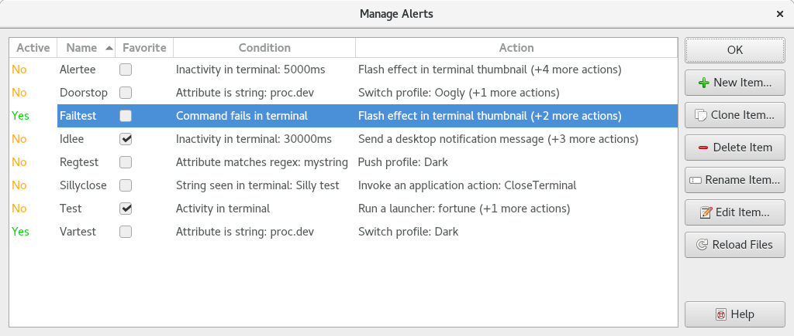

.. Copyright © 2018 TermySequence LLC
.. SPDX-License-Identifier: CC-BY-SA-4.0

Manage Alerts
=============

The Manage Alerts window is used to create, edit, rename, delete, and otherwise manage :doc:`alerts <../settings/alert>`. To access this window, use Settings→Manage Alerts.

.. _manage-alerts-example:

   Example Manage Alerts window.

The window has the following elements:

   Active
      Whether each alert is currently :termy:action:`active <SetAlert>` in any terminal (Yes or No). The colors used in this column can be customized using a :term:`stylesheet`.

   Name
      The name of each alert. There are some limitations on names, for example, names must start with an alphanumeric character. Invalid names will be flagged when creating a new alert.

   Favorite
      Alerts marked as favorite will be displayed at the top of alert selection menus.

   Condition
      A summary of each alert's :ref:`condition <alert-condition>`.

   Action
      A summary of each alert's :ref:`actions <alert-actions>`. Only one action will be summarized; additional actions will be displayed as a number in parentheses.

   New Item
      Creates a new empty alert and opens it in a :doc:`settings editor dialog <settings-editor>`.

   Clone Item
      Makes a copy of the selected alert and opens it in a :doc:`settings editor dialog <settings-editor>`.

   Delete Item
      Deletes the selected alert. Any profiles using it will be reassigned to the alert named "Default." Any alerts inheriting it will no longer have access to its bindings. Orphaned profiles and alerts will display a :doc:`warning <event-log>` when being loaded in the future.

   Rename Item
      Renames the selected alert.

   Edit Item
      Opens the selected alert in a :doc:`settings editor dialog <settings-editor>`.

   Reload Files
      Scans for new alert settings files and for changes to existing files.
