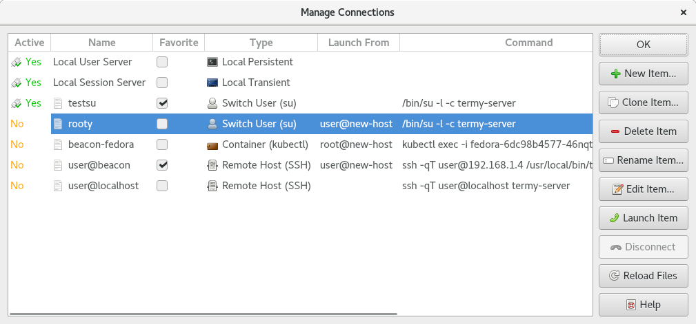

.. Copyright © 2018 TermySequence LLC
.. SPDX-License-Identifier: CC-BY-SA-4.0

Manage Connections
==================

The Manage Connections window is used to create, edit, rename, delete, and otherwise manage :doc:`connections <../settings/connection>`. To access this window, use Connect→Manage Connections.

.. _manage-connections-example:

   Example Manage Connections window.

The window has the following elements:

   Active
      Whether each connection is currently active, meaning that it has been :termy:action:`opened <OpenConnection>` and a :doc:`server <../settings/server>` is connected (Yes or No). The colors used in this column can be customized using a :term:`stylesheet`.

      :doc:`Batch connections <connect-batch>` do not have an active or inactive status.

   Name
      The name of each connection. There are some limitations on names, for example, names must start with an alphanumeric character. Invalid names will be flagged when creating a new connection.

      The connections associated with the :term:`persistent user server` and :term:`transient local server` are fixed and always present.

   Favorite
      Connections marked as favorite will be displayed in Connect→Favorites. Additionally, the most recently favorited connections of each type will be displayed directly in the Connect menu itself.

   Type
      Each connection's configured :termy:connection:`Type <Type/Type>`.

   Launch From
      The :doc:`server <../settings/server>` that each connection is configured to :termy:connection:`LaunchFrom <Server/LaunchFrom>`. If blank, the connection is run directly by :program:`qtermy`. The server name shown comes from the server's :ref:`saved state <server-state>`.

   Command
      Each connection's configured :termy:connection:`Command <Connection/Command>`.

   New Item
      Creates a new empty connection from scratch. Depending on the chosen :termy:connection:`type <Type/Type>`, the connection is opened in a :doc:`settings editor dialog <settings-editor>` or type-specific :doc:`dialog <index>`.

   Clone Item
      Makes a copy of the selected connection and opens it in a :doc:`settings editor dialog <settings-editor>` or :doc:`Batch Connection editor <connect-batch>` if it is a batch connection.

   Delete Item
      Deletes the selected connection.

   Rename Item
      Renames the selected connection.

   Edit Item
      Opens the selected connection in a :doc:`settings editor dialog <settings-editor>` or :doc:`Batch Connection editor <connect-batch>` if it is a batch connection.

   Launch Item
      Opens the selected inactive connection, as :termy:action:`OpenConnection` does.

   Disconnect
      Disconnects the selected active connection, as :termy:action:`DisconnectServer` does.

   Reload Files
      Scans for new connection settings files and for changes to existing files.
