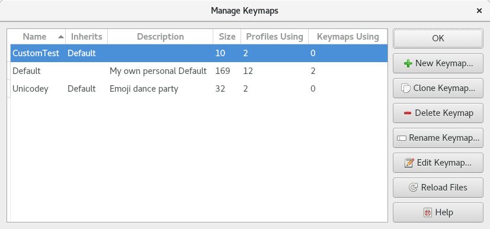

.. Copyright © 2018 TermySequence LLC
.. SPDX-License-Identifier: CC-BY-SA-4.0

Manage Keymaps
==============

The Manage Keymaps window is used to create, edit, rename, delete, and otherwise manage :doc:`keymaps <../settings/keymap>`. To access this window, use Settings→Manage Keymaps.

.. _manage-keymaps-example:

   Example Manage Keymaps window.

The window has the following elements:

   Name
      The name of each keymap. There are some limitations on names, for example, names must start with an alphanumeric character. Invalid names will be flagged when creating a new keymap. A keymap named "Default" must exist at all times.

   Inherits
      The keymap :ref:`inherited <keymap-inherit>` by each keymap, if applicable.

   Description
      The optional keymap :ref:`description <keymap-description>`.

   Size
      The number of bindings in each keymap, not including inherited bindings.

   Profiles Using
      The number of :doc:`profiles <../settings/profile>` which have each keymap assigned as their :termy:profile:`Keymap <Input/Keymap>`.

   Keymaps Using
      The number of :doc:`keymaps <../settings/keymap>` which inherit either directly or indirectly from each keymap.

   New Keymap
      Creates a new empty keymap from scratch and opens it in the :doc:`Keymap Editor <keymap-editor>`.

   Clone Keymap
      Makes a copy of the selected keymap and opens it in the :doc:`Keymap Editor <keymap-editor>`.

   Delete Keymap
      Deletes the selected keymap. Any profiles using it will be reassigned to the keymap named "Default." Any keymaps inheriting it will no longer have access to its bindings. Orphaned profiles and keymaps will display a :doc:`warning <event-log>` when being loaded in the future.

   Rename Keymap
      Rename the selected keymap or change its :ref:`parent keymap <keymap-inherit>`.

   Edit Keymap
      Opens the selected keymap in the :doc:`Keymap Editor <keymap-editor>`, as :termy:action:`EditKeymap` does.

   Reload Files
      Scans for new keymap settings files and for changes to existing files.
