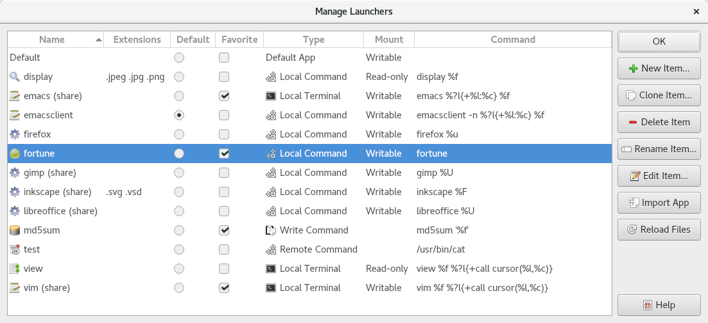

.. Copyright © 2018 TermySequence LLC
.. SPDX-License-Identifier: CC-BY-SA-4.0

Manage Launchers
================

The Manage Launchers window is used to create, edit, rename, delete, and otherwise manage :doc:`launchers <../settings/launcher>`. To access this window, use Settings→Manage Launchers.

.. _manage-launchers-example:

   Example Manage Launchers window.

The window has the following elements:

   Name
      The name of each launcher. There are some limitations on names, for example, names must start with an alphanumeric character. Invalid names will be flagged when creating a new launcher. A launcher named "Default" must exist at all times.

      Launchers loaded from the systemd directory :file:`{prefix}/share/qtermy/launchers` are denoted by "share" in parentheses. These cannot be renamed or deleted from within :program:`qtermy`. However they can be overridden by creating a launcher with the same name.

   Extensions
      Each launcher's configured :termy:launcher:`FileExtensions <Match/FileExtensions>`, if any.

   Default
      The launcher to use as the :term:`default launcher`. Normally this is the launcher named "Default" but this is not required.

   Favorite
      Launchers marked as favorite will be displayed at the top of :termy:action:`Open With <OpenFile>` menus. The configured :termy:launcher:`FileExtensions <Match/FileExtensions>` and :termy:launcher:`URISchemes <Match/URISchemes>` are used to prioritize launchers by matching against the target URL.

   Type
      Each launcher's configured :termy:launcher:`LaunchType <Launcher/LaunchType>`.

   Mount
      Each launcher's configured :termy:launcher:`MountType <Launcher/MountType>`.

   Command
      Each launcher's configured :termy:launcher:`Command <Command/Command>`. Launchers with a type of "Desktop Default" don't have a command since they launch via the :termy:action:`desktop <OpenDesktopUrl>`.

   New Item
      Creates a new empty launcher from scratch and opens it in a :doc:`settings editor dialog <settings-editor>`.

   Clone Item
      Makes a copy of the selected launcher and opens it in a :doc:`settings editor dialog <settings-editor>`.

   Delete Item
      Deletes the selected launcher.

   Rename Item
      Renames the selected launcher.

   Edit Item
      Opens the selected launcher in a :doc:`settings editor dialog <settings-editor>`.

   Import App
      Imports a new launcher from an existing `desktop entry files <https://standards.freedesktop.org/desktop-entry-spec/latest/>`_ of the kind commonly found at :file:`/usr/share/applications`. Then, opens the new launcher in a :doc:`settings editor dialog <settings-editor>` for review and customization.

   Reload Files
      Scans for new launcher settings files and for changes to existing files.
