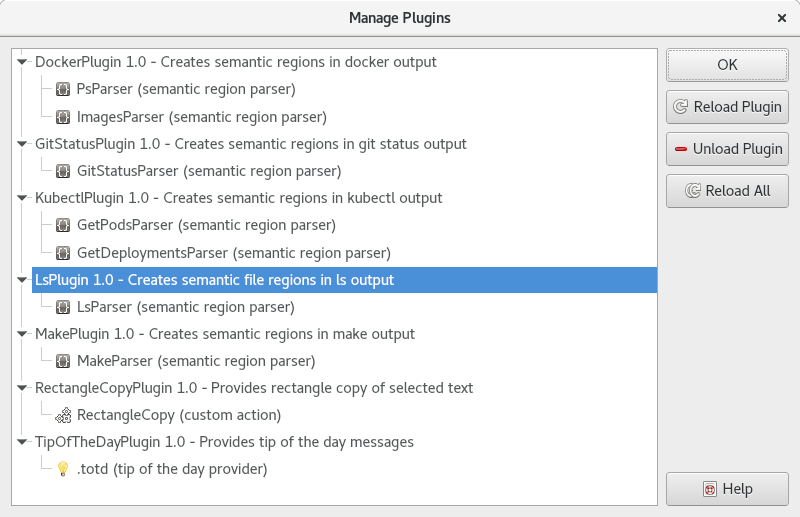

.. Copyright © 2018 TermySequence LLC
.. SPDX-License-Identifier: CC-BY-SA-4.0

Manage Plugins
==============

The Manage Plugins window is used to view, load, and unload :doc:`plugins <../plugins/index>`. To access this window, use Help→Manage Plugins.

.. _manage-plugins-example:

   Example Manage Plugins window.

The window has the following elements:

   Main Tree View
      Displays a two-level hierarchy consisting of loaded :doc:`plugins <../plugins/index>` and the individual features they implement. Each plugin entry contains:

         * The plugin's :js:attr:`name <plugin.pluginName>`, if set. If not set, or if an exception was thrown before it could be set, the name of the plugin's source file will be displayed instead.
         * The plugin's :js:attr:`version <plugin.pluginVersion>`, if set.
         * The plugin's :js:attr:`description <plugin.pluginDescription>`, if set.

      Each feature entry contains the name of the feature followed by the type of the feature in parentheses.

   Reload Plugin
      Reloads the selected plugin from its source file.

   Unload Plugin
      Unloads the selected plugin. The Reload All button will load it again, assuming its source file is still present.

   Reload All
      Unloads all plugins and then reloads all plugins from the source files.
