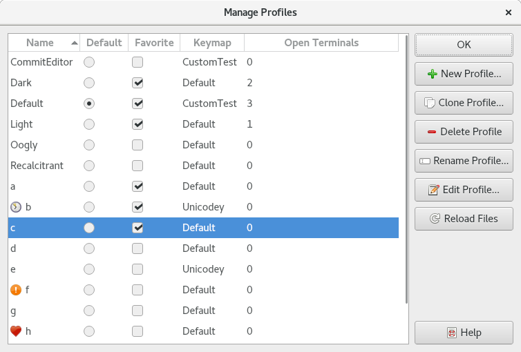

.. Copyright © 2018 TermySequence LLC
.. SPDX-License-Identifier: CC-BY-SA-4.0

Manage Profiles
===============

The Manage Profiles window is used to create, edit, rename, delete, and otherwise manage :doc:`profiles <../settings/profile>`. To access this window, use Settings→Manage Profiles.

.. _manage-profiles-example:

   Example Manage Profiles window.

The window has the following elements:

   Name
      The name of each profile. There are some limitations on names, for example, names must start with an alphanumeric character. Invalid names will be flagged when creating a new profile. A profile named "Default" must exist at all times.

      If the profile has a :termy:profile:`FixedThumbnailIcon <Appearance/FixedThumbnailIcon>`, it will be displayed with the name.

   Default
      The profile to use as the :term:`global default profile`. Normally this is the profile named "Default" but this is not required. Note that each :doc:`server <../settings/server>` has its own :termy:server:`default profile <Server/DefaultProfile>` which may or may not defer to the global default.

   Favorite
      Profiles marked as favorite will be displayed at the top of profile selection menus.

   Keymap
      The name of the :doc:`keymap <../settings/keymap>` assigned to each profile in its :termy:profile:`Keymap <Input/Keymap>` setting.

   Open Terminals
      The number of open terminals using each profile.

   New Profile
      Creates a new profile from scratch and opens it in a :doc:`settings editor dialog <settings-editor>`. It will be initialized using the compiled-in default settings.

   Clone Profile
      Makes a copy of the selected profile and opens it in a :doc:`settings editor dialog <settings-editor>`.

   Delete Profile
      Deletes the selected profile. Any terminals using it will be reassigned to the :term:`global default profile`.

   Rename Profile
      Renames the selected profile.

   Edit Profile
      Opens the selected profile in a :doc:`settings editor dialog <settings-editor>`, as :termy:action:`EditProfile` does.

   Reload Files
      Scans for new profile settings files and for changes to existing files.
