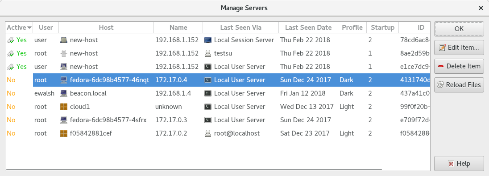

.. Copyright © 2018 TermySequence LLC
.. SPDX-License-Identifier: CC-BY-SA-4.0

Manage Servers
==============

The Manage Servers window is used to edit and delete :doc:`servers <../settings/server>`. Servers are created automatically with default settings when they are first seen by :program:`qtermy`.

To access this window, use Server→Manage Servers.

.. _manage-servers-example:

   Example Manage Servers window.

The window has the following elements:

   Active
      Whether each server is currently connected (Yes or No). The colors used in this column can be customized using a :term:`stylesheet`.

   User
      Each server's last reported ``user`` :term:`attribute`, from its :ref:`saved state <server-state>`.

   Host
      Each server's last reported ``host`` :term:`attribute`, from its :ref:`saved state <server-state>`.

   Name
      Each server's last reported ``name`` :term:`attribute`, from its :ref:`saved state <server-state>`.

   Last Seen Via
      The :doc:`connection <../settings/connection>` over which each server was last seen, from its :ref:`saved state <server-state>`.

   Last Seen Date
      The date when each server was last seen, from its :ref:`saved state <server-state>`.

   Profile
      Each server's configured :termy:server:`DefaultProfile <Server/DefaultProfile>`. If blank, the server defers to the :term:`global default profile`.

   Startup
      The number of items in each server's :termy:server:`StartupProfiles <Server/StartupProfiles>`.

   ID
      Each server's :term:`unique identifier <server identifier>`.

   Edit Item
      Opens the selected server in a :doc:`settings editor dialog <settings-editor>`.

   Delete Item
      Deletes the selected server. It will be treated as a new server if seen again.

      .. caution:: Any :doc:`connection <../settings/connection>` which is configured to :termy:connection:`LaunchFrom <Server/LaunchFrom>` the selected server will stop working.

   Reload Files
      Scans for new server settings files and for changes to existing files.
