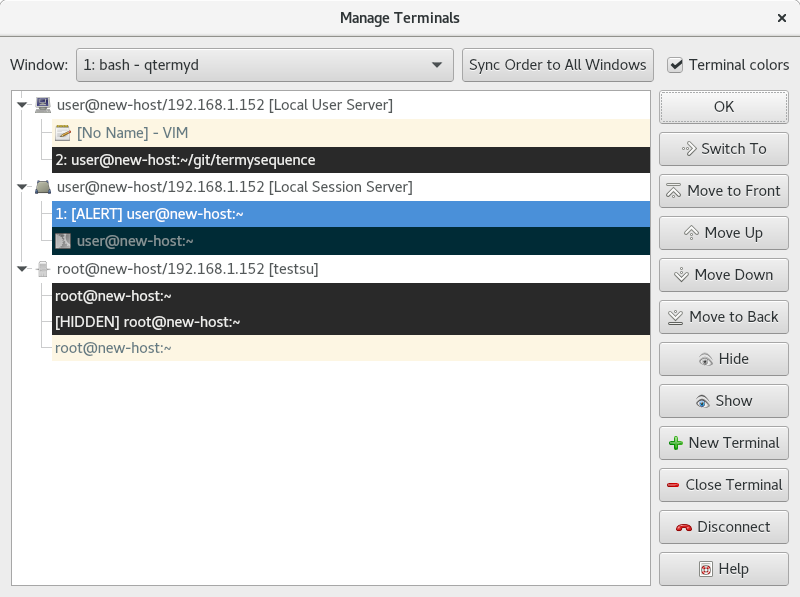

.. Copyright © 2018 TermySequence LLC
.. SPDX-License-Identifier: CC-BY-SA-4.0

Manage Terminals
================

The Manage Terminals window displays a list of :doc:`servers <../settings/server>` and terminals in tree view format. It provides another view of the same information displayed in the :doc:`Terminals tool <../tools/terminals>`.

To access this window, use File→Manage Terminals.

.. _manage-terminals-example:

   Example Manage Terminals window.

The window has the following elements:

   Window
      Each application window has its own independent terminal ordering and hidden/shown terminals. Select the application window whose ordering will be displayed.

   Sync Order to All Windows
      Copies the current terminal ordering and hidden/shown terminals to all application windows.

   Terminal colors
      If checked, each terminal's entry will be displayed in the terminal's current foreground and background colors.

   Main Tree View
      Displays the application window's terminal ordering in a two-level hierarchy consisting of servers and terminals. Each server entry contains:

         * The server's :termy:server:`icon <Appearance/FixedThumbnailIcon>`
         * The server's user, host, and name :term:`attributes <attribute>`
         * In square brackets, the name of the :doc:`connection <../settings/connection>` over which the server is connected

      Each terminal entry contains:

         * The terminal's :doc:`thumbnail icon <icon-rule-editor>`, if any
         * The terminal's active pane index, if any. See :termy:global:`ShowThumbnailIndex <Appearance/ShowThumbnailIndex>`.
         * In square brackets and all caps, one or more status strings describing terminal states. Many of these correspond to the graphical :termy:profile:`indicators <Appearance/ShowMainIndicators>`.
         * The terminal's title

   Switch To
      Switches to the selected terminal in the application window's active pane, as :termy:action:`SwitchTerminal` does.

   Move to Front
      Moves the selected server or terminal to the front of the ordering, as :termy:action:`ReorderServerFirst` and :termy:action:`ReorderTerminalFirst` do.

   Move Up
      Moves the selected server or terminal forward, as :termy:action:`ReorderServerForward` and :termy:action:`ReorderTerminalForward` do.

   Move Down
      Moves the selected server or terminal backward, as :termy:action:`ReorderServerBackward` and :termy:action:`ReorderTerminalBackward` do.

   Move to Back
      Moves the selected server or terminal to the back of the ordering, as :termy:action:`ReorderServerLast` and :termy:action:`ReorderTerminalLast` do.

   Hide
      Hides the selected server or terminal, as :termy:action:`HideServer` and :termy:action:`HideTerminal` do.

   Show
      Shows the selected server or terminal, as :termy:action:`ShowServer` and :termy:action:`ShowTerminal` do.

   New Terminal
      Creates a new terminal on the selected server using the server's default profile, as :termy:action:`NewTerminal` does.

   Close Terminal
      Closes the selected terminal, as :termy:action:`CloseTerminal` does.

   Disconnect
      Disconnects the selected server, as :termy:action:`DisconnectServer` does.
