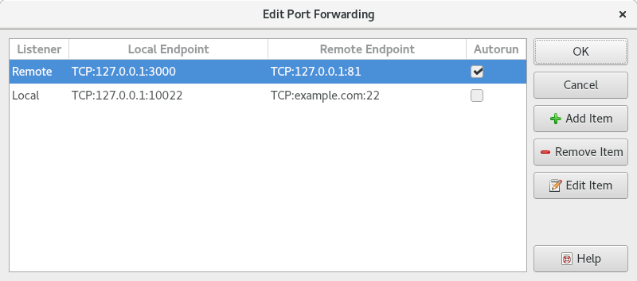

.. Copyright © 2018 TermySequence LLC
.. SPDX-License-Identifier: CC-BY-SA-4.0

Port Forwarding
===============

.. contents::
   :local:

.. _manage-port-forwarding:

Manage Port Forwarding
----------------------
The Manage Port Forwarding window is used to create, start, stop, and otherwise manage port forwarding tasks. Port forwarding tasks can be launched on demand from this window or by calling :termy:action:`LocalPortForward` and :termy:action:`RemotePortForward`. Tasks can also be launched automatically at server connection time via server :termy:server:`PortForwardingRules <Server/PortForwardingRules>`. To access this window, use Server→Port Forwarding or the :termy:action:`ManagePortForwarding` action.

.. _manage-port-forwarding-example:

   Example Manage Port Forwarding window.

The window has the following elements:

   Main Tree View
      Displays a three-level hierarchy consisting of :doc:`servers <../settings/server>`, port forwarding :doc:`tasks <../tools/tasks>`, and individual socket connections. Each server entry contains:

         * The server's :termy:server:`icon <Appearance/FixedThumbnailIcon>`
         * The server's user, host, and name :term:`attributes <attribute>`
         * In square brackets, the name of the :doc:`connection <../settings/connection>` over which the server is connected

      Each task entry contains:

         * The listening side (Local or Remote), socket type, and socket address.
         * An arrow symbol
         * The connecting side (Local or Remote), socket type, and socket address.
         * The state of the task (Running, Canceled, etc.)

      Each socket connection entry contains the source address of the incoming connection to the listening side. Running tasks with no active socket connections will display a string to that effect instead of connection entries.

   New Task
      Brings up a :ref:`dialog box <add-port-forwarding>` (described below) to create a new port forwarding task on the selected server.

   Edit Server
      Opens the selected :doc:`server <../settings/server>` in a :doc:`settings editor dialog <settings-editor>`. This can be used to edit the server's :termy:server:`PortForwardingRules <Server/PortForwardingRules>`, a list of saved port forwarding tasks which can be optionally started automatically at server connection time.

   Start Task
      Restarts the selected task if it is not in the running state, as :termy:action:`RestartTask` does.

   Cancel Task
      Cancels the selected task if it is in the running state, as :termy:action:`CancelTask` does.

   End Connection
      Terminates the selected socket connection, closing the socket on both ends. This is for removing unwanted or unexpected connections only.

      .. caution:: How this is handled by the applications communicating over the socket will vary from application to application. It's possible that data loss may result. Use with caution.

.. _edit-port-forwarding:

Port Forwarding Editor
----------------------

The Port Forwarding Editor is used to edit the list of saved port forwarding rules stored in the :termy:server:`PortForwardingRules <Server/PortForwardingRules>` server setting.

.. _port-forwarding-editor-example:

   Example Port Forwarding Editor dialog.

The dialog has the following elements:

   Listener
      Whether each saved task is :termy:action:`local <LocalPortForward>` or :termy:action:`remote <RemotePortForward>`.

   Local Endpoint
      Each saved task's local endpoint

   Remote Endpoint
      Each saved task's remote endpoint

   Autorun
      Whether each saved task should be launched automatically at server connection time. Saved tasks can be launched on demand from the :ref:`Manage Port Forwarding window <manage-port-forwarding>`.

   Add Item
      Brings up a :ref:`dialog box <add-port-forwarding>` (described below) to add a new saved task.

   Remove Item
      Removes the selected saved task

   Edit Item
      Brings up a :ref:`dialog box <add-port-forwarding>` (described below) to edit the selected saved task.

.. _add-port-forwarding:

Port Forwarding Dialog
----------------------

The Port Forwarding Dialog is used to specify an individual port forwarding task. It is shown from both the :ref:`Manage Port Forwarding window <manage-port-forwarding>` and the :ref:`Port Forwarding Editor <edit-port-forwarding>`.

.. _port-forwarding-dialog-example:

   Example Port Forwarding dialog.

The dialog has the following elements:

   Edit server to make permanent changes
      A reminder that port forwarding tasks created directly from the :ref:`Manage Port Forwarding window <manage-port-forwarding>` are not saved. Click the link to edit the :doc:`server settings <../settings/server>` instead. The relevant setting within the server is :termy:server:`Server/PortForwardingRules`.

   Forwarding type
      Choose whether the port forwarding task will listen for connections on the local (:program:`qtermy`) side or the remote (:doc:`termy-server <../server>`) side.

   Listen type
      Choose the type of listening socket

   Listen address
      Specify the address of the listening socket:

        * For TCP sockets: the IP address or hostname to listen on. For a listening socket bound to all addresses, leave the address field empty.
        * For Unix-domain sockets: the socket file path to listen on. It will be created but its parent directory must exist and be writable.

   Listen port
      Specify the port to listen on (TCP only)

   Connect type
      Choose the type of connecting socket

   Connect address
      Specify the destination IP address, hostname, or Unix-domain socket path

   Connect port
      Specify the destination port (TCP only)
