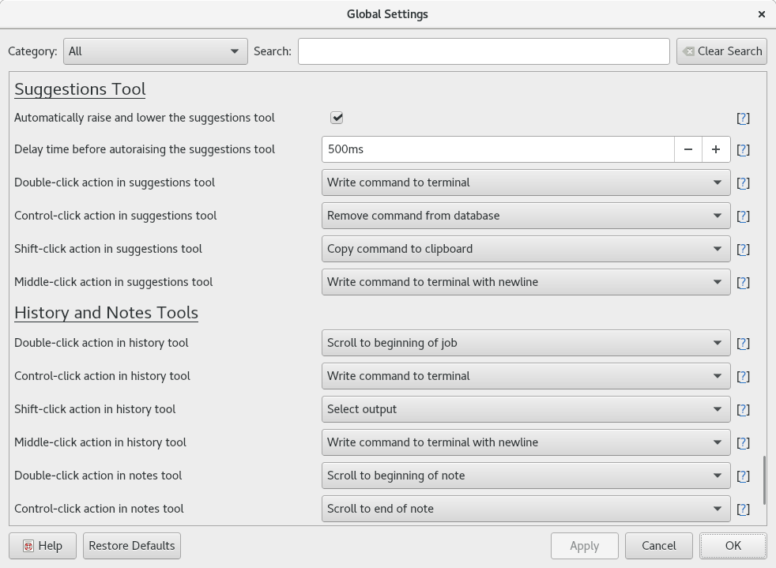

.. Copyright © 2018 TermySequence LLC
.. SPDX-License-Identifier: CC-BY-SA-4.0

Settings Editor
===============

The Settings Editor dialog is used to edit the following :doc:`settings objects <../settings/index>`:

   * :doc:`Global settings <../settings/global>`
   * :doc:`Profile settings <../settings/profile>`
   * :doc:`Alert settings <../settings/alert>`
   * :doc:`Launcher settings <../settings/launcher>`
   * :doc:`Server settings <../settings/server>`
   * :doc:`Connection settings <../settings/connection>` other than :doc:`batch connections <connect-batch>` (when editing a saved connection from the :doc:`Manage Connections window <manage-connections>`).

The layout of the dialog is procedurally generated from the settings that make up each settings object. Changes made to certain global and profile settings take effect immediately and will be visible in the application window. Canceling the dialog will revert all changes.

.. tip:: Click the question mark link next to any setting to open the documentation for that setting. Hover over the question mark link to view the documentation URL.

.. _settings-editor-example:

   Example Settings Editor dialog showing Global settings.

The dialog has the following elements:

   Main Settings View
      A procedurally generated list of settings. Settings category names are shown in large text. Each setting entry has the following elements:

         * A short description of the setting. Use the question mark link to access complete documentation for the setting.
         * An editor widget used to modify the setting's value. This will vary depending on the type of setting.
         * A link to the setting's documentation, displayed as a question mark in square brackets.

   Category
      Select a category from the dropdown list to filter the settings.

   Search
      Enter a search string to filter the settings by their description.

   Clear Search
      Click to clear the search string and search category, displaying all settings.

   Restore Defaults
      Resets all settings (not just filtered settings) to their compiled-in default values. Canceling the dialog will undo this action.
