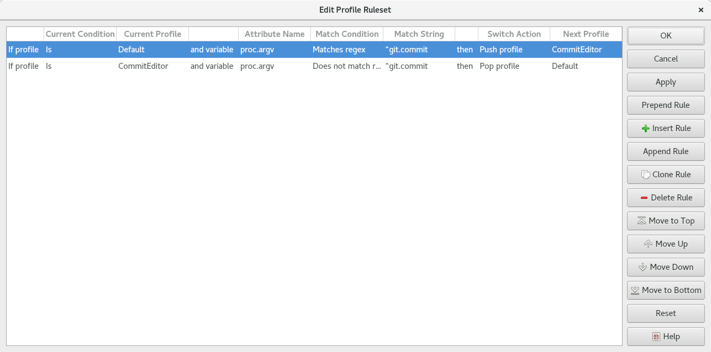

.. Copyright © 2018 TermySequence LLC
.. SPDX-License-Identifier: CC-BY-SA-4.0

Profile Rules Editor
====================

.. highlight:: none

The ruleset managed by the Profile Rules Editor dialog is used to automatically switch a terminal's :doc:`profile <../settings/profile>` based on terminal :term:`attribute` changes. Profiles can be :termy:action:`switched <SwitchProfile>`, :termy:action:`pushed <PushProfile>`, and :termy:action:`popped <PopProfile>` by profile autoswitch rules.

Rules are processed in order from top to bottom whenever an :term:`attribute` named in any rule changes. Only the action specified by the first matching rule will be taken. If no rule matches, nothing is done.

The first rule shown in the :ref:`nearby figure <switch-rule-example>` switches from the profile named "Default" to the profile named "CommitEditor" when a :command:`git commit` command is run in the terminal. The second rule switches back when the command has finished.

To access this window, use Settings→Profile Autoswitch Rules or the :termy:action:`EditSwitchRules` action.

.. _switch-rule-example:

   Example Profile Rules Editor dialog.

The dialog has the following elements:

   Current Condition
      The condition that must be met on the terminal's current profile for the rule to match. Click to edit.

         * *Is*: The terminal's current profile must be the one named by the rule's current profile.
         * *Is Anything*: The terminal's current profile can be any profile. The rule's current profile name is ignored.

   Current Profile
      The profile name to match against the terminal's current profile. Click to edit.

   Attribute Name
      The name of the terminal :term:`attribute` to match against. Click to edit.

.. _switch-rule-condition:

   Match Condition
      The condition that must be met or not met on the attribute value for the rule to match. All matching is case sensitive. Click to edit.

         * *Is*: The attribute value must equal the match string.
         * *Is set*: The attribute value must be set to any value, including the empty string. The match string is ignored.
         * *Starts with*: The attribute value must start with the match string.
         * *Ends with*: The attribute value must end with the match string.
         * *Contains*: The attribute value must contain the match string at any position.
         * *Matches regex*: The attribute value must match the match string, which is interpreted as an ECMAScript regular expression.

   Match String
      The string or regular expression to match against the attribute value. Click to edit.

   Switch Action
      The action to take upon a match. Click to edit.

         * *Switch profile*: Call :termy:action:`SwitchProfile` on the terminal using the next profile name.
         * *Push profile*: Call :termy:action:`PushProfile` on the terminal using the next profile name.
         * *Pop profile*: Call :termy:action:`PopProfile` on the terminal. The next profile name is ignored.

   Next Profile
      The profile name to switch or push to upon a match. Click to edit.

   Prepend Rule
      Inserts a new rule at the beginning of the list

   Insert Rule
      Inserts a new rule at the location of the selected rule

   Append Rule
      Adds a new rule to the end of the list

   Clone Rule
      Duplicates the selected rule in the list

   Delete Rule
      Removes the selected rule from the list

   Move to Top
      Moves the selected rule to the top of the list

   Move Up
      Moves the selected rule up in the list

   Move Down
      Moves the selected rule down in the list

   Move to Bottom
      Moves the selected rule to the bottom of the list

   Apply
      Saves changes made in the dialog

   Reset
      Discards changes made in the dialog

.. _switch-rule-file:

The profile autoswitch rules are stored at :file:`{$HOME}/.config/qtermy/switch.rules`. Rule definition lines within this file have the following format::

   current_condition "current_profile" match_condition "attribute_name" "match_string" action "next_profile"

The valid current condition types are ``is`` and ``any``. The valid action types are ``switch``, ``push`` and ``pop``. The valid match condition types are: ``is``, ``set``, ``startswith``, ``endswith``, ``contains``, and ``regex`` as described under :ref:`Match Condition <switch-rule-condition>` above. Prefix an exclamation mark (!) to the condition type to negate it.

All fields must be present even if they are not used, but unused fields may be empty strings. Blank lines and comment lines starting with a hash mark (#) in the first column are permitted.
