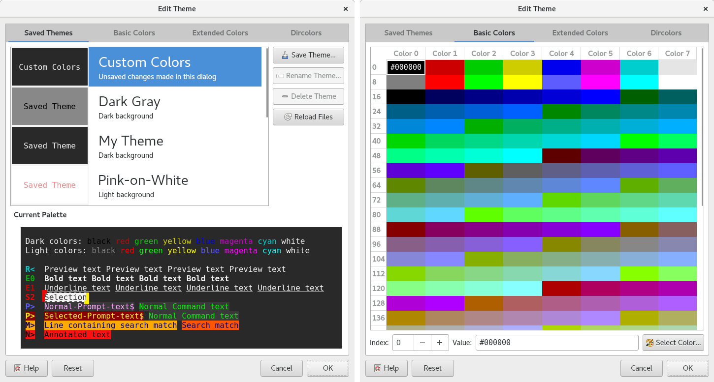
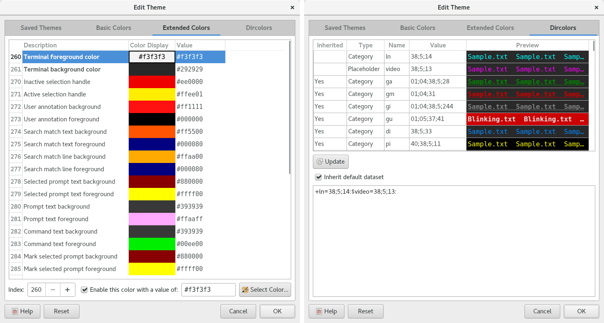

.. Copyright © 2018 TermySequence LLC
.. SPDX-License-Identifier: CC-BY-SA-4.0

Theme Editor
============

The Theme Editor dialog is used to:

   * Create, edit, rename, delete, and otherwise manage :doc:`themes <../settings/theme>`.
   * Edit the :termy:profile:`Appearance/Palette` and :termy:profile:`Files/Dircolors` settings of a :doc:`profile <../settings/profile>`.
   * Directly :ref:`adjust <adjust-colors>` the palette and dircolors of individual terminals.

To access the Theme Editor dialog, use the Theme button in the :ref:`Adjust Colors dialog <adjust-colors>`, which can be accessed via View→Adjust Colors, the terminal context menu, or :termy:action:`AdjustTerminalColors` action. Or, edit a profile and use the Theme button under the :termy:profile:`Appearance/Palette` setting in the :doc:`settings editor <settings-editor>`.

Note that editing a profile's :termy:profile:`Files/Dircolors` setting brings up a :doc:`separate dialog <dircolors-editor>` containing only a dircolors editor. That dialog is equivalent to this dialog's Dircolors tab.

Changes made within the dialog take effect immediately and will be visible in the affected terminal or terminals. Canceling the dialog will revert all changes. To undo changes made using the dialog without closing it, use the Reset button.

.. _theme-editor-example-1:

   Example Theme Editor dialog, tabs 1 and 2.

.. _theme-editor-example-2:

   Example Theme Editor dialog, tabs 3 and 4.

The dialog has the following elements:

   Reset
      Discards changes made in the dialog.

Saved Themes
------------

   Theme Table
      The list of defined themes. Each entry in the list contains:

         * A preview of the theme's primary foreground and background colors along with the type of the theme:

            * *Custom Colors*: An entry containing the custom edits that have been made within the dialog itself, if they do not match any theme. This prevents custom edits from being lost when clicking on another theme in the list.
            * *Saved Theme*: An ordinary :doc:`theme <../settings/theme>` saved under :file:`{$HOME}/.config/qtermy/themes`.
            * *Builtin Theme*: A compiled-in default theme. These cannot be deleted or renamed, but can be overridden by creating a saved theme with the same name.

           .. tip:: :program:`qtermy` includes several built-in themes, including dark and light `Solarized <http://ethanschoonover.com/solarized>`_ themes with dircolors. Try them out!

         * The theme's name in large text. There are some limitations on names, for example, names must start with an alphanumeric character. Invalid names will be flagged when creating a new theme.
         * The theme's :termy:theme:`Group <Theme/Group>` in small text.

      Clicking a theme in the list will immediately load its contents into the dialog. Any customizations made in the dialog will be overwritten, but can be restored using the *Custom Colors* entry at the top of the list.

      Themes with the :termy:theme:`LowPriority <Theme/LowPriority>` setting enabled will be shown at the bottom of the list. This is intended for themes that only exist to be used with the :termy:action:`RandomTerminalTheme` action.

   Preview Area
      Displays a preview of the :ref:`primary 16-color palette <theme-editor-basic>` and :ref:`extended colors <theme-editor-extended>` as they are currently configured in the dialog.

   Save Theme
      Creates a new :doc:`theme <../settings/theme>` using the dialog's current contents.

   Rename Theme
      Renames the selected saved theme.

   Delete Theme
      Deletes the selected saved theme.

   Reload Files
      Scans for new theme settings files and for changes to existing files.

.. _theme-editor-basic:

Basic Colors
------------

   Color Table
      A standard 256-color terminal palette consisting of 16 primary colors (8 standard and 8 "bright" colors) followed by 240 additional colors (normally fixed).

   Color Editor
      Select a color by clicking in the table or entering an index number in the spin box. Edit the selected color by entering an RGB hex triple in the text field or by clicking Select Color to bring up a `color selection dialog <http://doc.qt.io/qt-5/qcolordialog.html>`_.

.. _theme-editor-extended:

Extended Colors
---------------

   Color Table
      A list of extended colors numbered from 256, described in the table below. Some index numbers are missing from the list; these are XTerm colors which :program:`qtermy` does not support.

      Many extended colors can be *disabled*, which prevents their use in the terminal viewport, :ref:`Marks <marks-widget>` and :ref:`Minimap <minimap-widget>` widgets, and elsewhere. The terminal's primary foreground and background colors will be used instead.

   Color Editor
      Select a color by clicking in the table or entering an index number in the spin box. Enable and disable the color using the check box. Edit the selected color (if enabled) by entering an RGB hex triple in the text field or by clicking Select Color to bring up a `color selection dialog <http://doc.qt.io/qt-5/qcolordialog.html>`_.

=====  ====================================  ========
Index  Extended color pair                   Use case
=====  ====================================  ========
260    Terminal foreground / background      The primary terminal foreground and background colors. These two colors can be edited directly from the :ref:`Adjust Colors dialog <adjust-colors>` or via the :termy:profile:`ForegroundColor <Appearance/ForegroundColor>` and :termy:profile:`BackgroundColor <Appearance/BackgroundColor>` profile settings.
270    Inactive / Active selection handle    Used to draw :ref:`selection handles <selection-handle-lookup>`.
272    User annotation                       Used to draw :term:`annotated text <annotation>` in the terminal viewport.
274    Search match text                     Used to draw the text that matches a :doc:`search <../tools/search>` in the terminal viewport.
276    Search match line                     Used to draw the text other than the matching text on a line containing a :doc:`search <../tools/search>` match in the terminal viewport.
278    Selected prompt text                  Used to draw the :term:`selected prompt` in the terminal viewport. This requires :doc:`shell integration <../shell-integration>`.
280    Prompt text                           Used to draw prompts other than the :term:`selected prompt` in the terminal viewport. This requires :doc:`shell integration <../shell-integration>`.
282    Command text                          Used to draw command text in the terminal viewport. This requires :doc:`shell integration <../shell-integration>`.
284    Mark selected prompt                  Used to :ref:`mark <marks-widget>` the :term:`selected prompt`. This requires :doc:`shell integration <../shell-integration>`.
286    Mark current prompt                   Used to :ref:`mark <marks-widget>` the current prompt (where the next command will be typed). This requires :doc:`shell integration <../shell-integration>`.
288    Mark running                          Used to :ref:`mark <marks-widget>` the currently running command. This requires :doc:`shell integration <../shell-integration>`.
290    Mark exit status zero                 Used to :ref:`mark <marks-widget>` commands which have exited with status zero (indicating success). This requires :doc:`shell integration <../shell-integration>`.
292    Mark exit status nonzero              Used to :ref:`mark <marks-widget>` commands which have exited with a nonzero status (indicating failure). This requires :doc:`shell integration <../shell-integration>`.
294    Mark exit on signal                   Used to :ref:`mark <marks-widget>` commands which were killed by a signal rather than exiting normally. This requires :doc:`shell integration <../shell-integration>`.
296    Mark user annotation                  Used to :ref:`mark <marks-widget>` the location of :term:`annotated text <annotation>`.
298    Mark search match                     Used to :ref:`mark <marks-widget>` the location of the current :doc:`search <../tools/search>` match.
=====  ====================================  ========

Dircolors
---------

Refer to :doc:`dircolors-editor`.
