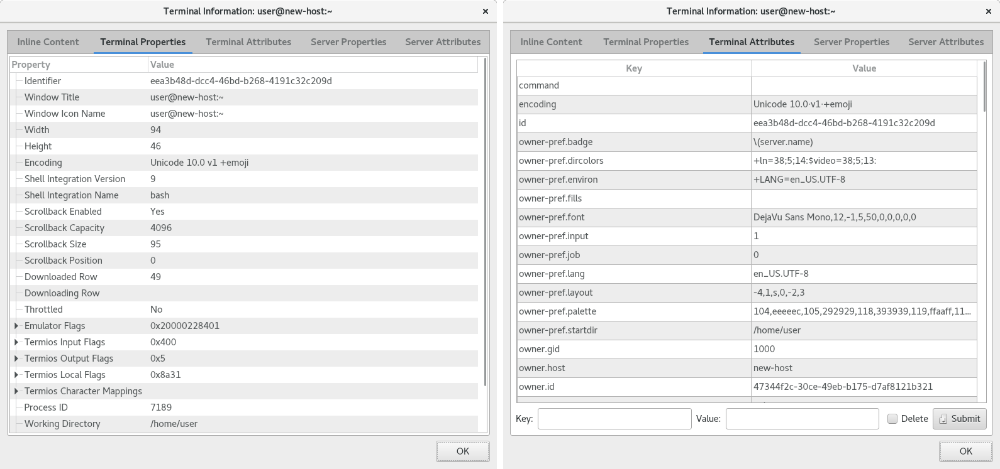
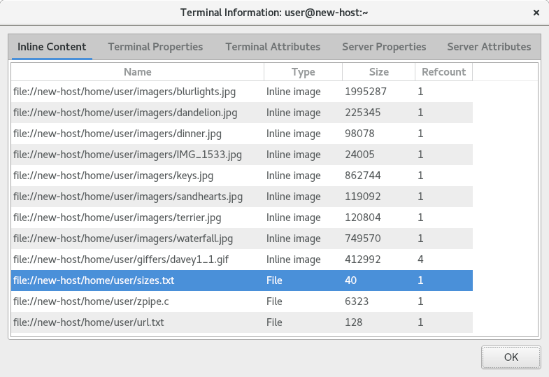

.. Copyright © 2018 TermySequence LLC
.. SPDX-License-Identifier: CC-BY-SA-4.0

View Information
================

The View Information window displays information about a connected terminal or :doc:`server <../settings/server>`. This includes terminal and server :term:`attributes <attribute>` as well as a variety of other properties. To access the window:

   * Use Terminal→View Terminal Information or Server→View Server Information
   * Click the terminal size in the status bar
   * Use View Inline Content from the context menu of an inline content item
   * Call the :termy:action:`ViewTerminalInfo`, :termy:action:`ViewTerminalContent`, or :termy:action:`ViewServerInfo` actions.

A terminal information window displays information on both the terminal and its parent :doc:`server <../settings/server>`. In addition, the window's Inline Content tab displays information about inline content items displayed in the terminal using :doc:`termy-download <../man/download>`, :doc:`termy-imgcat <../man/download>`, and :doc:`termy-imgls <../man/download>`.

The information window also supports direct editing of attributes on the Attributes tabs. This feature is intended for use when developing and debugging :doc:`plugins <../plugins/index>`.

.. _view-information-properties-example:

   Example View Terminal Information window, Attributes and Properties tabs.

.. _view-information-content-example:

   Example View Terminal Information window, Inline Content tab.

The window contains the following elements:

   Inline Content
      Only applicable to terminals. Displays the following information for each content item:

         * The filename attached to the content item, if any
         * The type of content item: inline image or arbitrary file
         * The size of the content item
         * The number of times the content item appears in the terminal

      Right click an item to bring up a context menu with content-related actions.

      .. important:: Images may be reduced to thumbnails for inline display. When downloading inline images, to ensure that the original image data is downloaded, download the original image file rather than the thumbnail.

   Terminal Properties
      Various properties of the terminal. Use the Shell Integration properties to determine whether :doc:`shell integration <../shell-integration>` is enabled in the terminal.

   Terminal Attributes
      The terminal's :term:`attributes <attribute>`.

      To edit an attribute, uncheck the Delete check box, specify the Key and Value, and click Submit. To delete an attribute, check the Delete checkbox, specify the Key, and click Submit.

      Note that certain attributes cannot be modified by clients, and certain other attributes can only be modified by the terminal's :termy:action:`owner <TakeTerminalOwnership>`.

   Server Properties
      Various properties of the server.

   Server Attributes
      The server's :term:`attributes <attribute>`.

      To edit an attribute, uncheck the Delete check box, specify the Key and Value, and click Submit. To delete an attribute, check the Delete checkbox, specify the Key, and click Submit.

      Note that certain attributes cannot be modified by clients.
