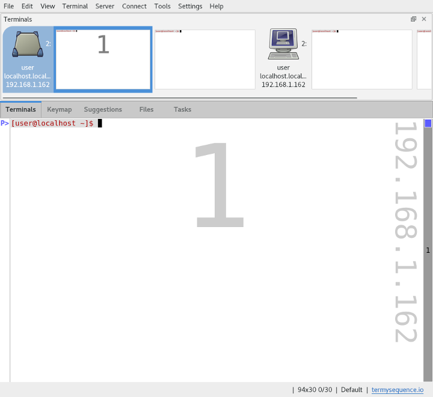

.. Copyright © 2018 TermySequence LLC
.. SPDX-License-Identifier: CC-BY-SA-4.0

First Steps
===========

Got :program:`qtermy` running? Great! Follow along with this tutorial to familiarize yourself with some aspects of how TermySequence works.

First off, if your system employs systemd, you may be greeted with a prompt to run :doc:`man/setup`. Saying yes opens a new terminal and runs the setup program. As part of the setup, your :term:`persistent user server` (discussed below) will be killed and you'll get to see the nice red X indicators that pop up when :program:`qtermy` loses a connection to a multiplexer server. To get the multiplexer back on its feet, use *Connect→Persistent Local Server* or restart the application. Saying no won't break anything immediately, and you can always do the :doc:`systemd setup <systemd>` by hand later.

With that out of the way, what you see before you should resemble :ref:`this <first-steps-example>`:

.. _first-steps-example:

If the shell prompt appears as plain black text without a "P" :ref:`mark <marks-widget>` next to it, shell integration isn't enabled in the terminal. Follow the instructions :doc:`here <shell-integration>` to install it. This is optional but highly recommended, since it enables many useful features within :program:`qtermy`.

Terminals, Servers, Windows, and Panes
--------------------------------------

Let's have a look at the :doc:`Terminals tool <tools/terminals>` first. It's at the top of the window by default, but it can be dragged around and docked elsewhere. The Terminals tool displays an ordered list of all the currently connected servers (i.e. terminal multiplexers) and their terminals. Don't worry if some terminal thumbnails look improperly sized. The terminals will resize when switched to. The starting terminal size can be adjusted in the profile settings (discussed below).

By default, :program:`qtermy` connects to not one but two servers on startup. These are your :term:`transient local server` (on the left) and your :term:`persistent user server` (on the right). The *transient local server* is run directly by :program:`qtermy` as a private child process. It will go away when the application is closed and its terminals will be lost. However, this also means that it's part of your desktop session (hence the desktop icon) and you can launch GUI applications and the like from shell prompts. In contrast, the *persistent user server* is intended to run forever, or least until the next reboot. This is the typical usage model for terminal emulator multiplexers which are "detached" from the user login session.

At this point, let's make it easier to tell the terminals apart. Right-click on a terminal and choose :ref:`Adjust Colors <adjust-colors>`, then select a predefined color theme from the Theme dropdown. Choose a different theme for each terminal or run some commands in the terminals to produce different output. These color adjustments are only temporary; we'll discuss profile settings below.

One thing you may have noticed is the big number right in the middle of the terminal. This number is the *pane* or *viewport* index number. Open a new window using *File→New Window*. Now experiment with switching terminals by clicking them in the Terminals tool of either window or by pressing Shift+Left and Shift+Right.

In :program:`qtermy`, terminals are independent of the viewports which display them. It's possible to open multiple viewports onto the same terminal and scroll them independently. The Terminals tool always displays the terminal screen in its native size, along with the index number of any viewport showing the terminal. In addition to opening new windows, additional viewports can be created using the split window actions under *View→Split View*.

.. The index numbers and Terminals tool are intended to help you answer the eternal question: *what terminal am I looking at right now?*

.. For another take on the Terminals tool, check out the :doc:`Manage Terminals window <dialogs/manage-terminals>` at *File→Manage Terminals*.

Keymap Tool
-----------

Okay, so Shift+Left and Shift+Right switch terminals in the current viewport. What other key bindings are there? Bring up the :doc:`Keymap tool <tools/keymap>` by clicking its tab or using *Tools→Activate→Keymap*. In this tool, a complete list of key bindings is displayed. It's specifically designed to help you get up to speed with the keyboard.

A word about :doc:`keymaps <settings/keymap>`: they are highly customizable. Key bindings come in two flavors: action bindings and literal bindings. A literal binding sends some UTF-8 text to the terminal as input. An action binding runs an :doc:`action <actions>`, which tells :program:`qtermy` to do something. There are roughly 300 actions to choose from, and you can write :doc:`your own <plugins/action>` in Javascript. All of :program:`qtermy`'s menus are just lists of action bindings.

:program:`qtermy` has a *command mode* for constructing dual-mode keymaps in the :program:`vi` style. It's also possible to create combination bindings with two separate keypresses. But the keymap mode that's most important to know about is *selection mode*.

Run a command such as :command:`man ls` that prints some text. Now, make a selection with the mouse. In the Keymap tool, you'll see that selection mode is now active and along with it a set of key bindings for mouseless selection editing. Use the space bar to choose a selection "handle" and then try using the WASD bindings to move the handle around. Other selection mode bindings are shown in the Keymap tool. Press Escape to cancel the selection and exit selection mode.

Selection mode, along with many other things, can be configured in the :doc:`global settings <settings/global>` (*Settings→Edit Global Settings*).

Profile Settings
----------------

Let's make it so the two local servers have different color terminals by default. First, undo the temporary changes made above using *View→Undo All Adjustments*. This restores all terminals to the settings specified in their :doc:`profiles <settings/profile>`.

Profile? What's that? Choose *Settings→Manage Profiles* and in the :doc:`Manage Profiles window <dialogs/manage-profiles>` that appears, select the Default profile and click *Edit Profile*.

What appears is the :doc:`Settings Editor dialog <dialogs/settings-editor>` used to edit most of :program:`qtermy`'s :doc:`settings objects <settings/index>`. Of particular note in this dialog are the little question marks along the right-hand side, one for each individual setting. Clicking those will bring you to the relevant documentation on this site.

We want to change the profile's color theme, so find the :termy:profile:`color theme <Appearance/Palette>` setting (it's in the Appearance category) and select your preferred color theme from the dropdown. Then click OK.

Next, click *Clone Profile* to clone the default profile. Give the new profile the name "Transient". In the settings editor window for the new profile, change the color theme to be different from the one in default profile. Click OK in both dialogs.

Now we'll make it so the transient local server uses the new profile by default. Click on the transient local server (desktop icon) in the Terminals tool, then choose *Server→Edit Server*. This brings up a settings editor for another type of settings object, the :doc:`server settings <settings/server>`. In the :termy:server:`default profile <Server/DefaultProfile>` option, select the new profile from the dropdown. Then click OK. Now, when you restart :program:`qtermy`, the terminals belonging to the transient local server will use the new profile.

Connections
-----------

Let's try connecting to another server. For this part, it's assumed that:

 * You have access to the root account (or some other user account) on your machine.
 * That account has :program:`termy-server` in its :envvar:`PATH`.

To become root using :program:`sudo`, go to *Connect* and choose *Superuser (sudo)*. Otherwise, choose *Switch User* and in the :ref:`dialog box <connect-user>` that appears, select "Switch User (su)" from the dropdown, enter the username, and click OK.

If a password is required, the :doc:`Connection Status dialog <dialogs/connection-status>` will appear to collect it. If all goes well, the connection will succeed and the user's persistent user server will appear in the Terminals tool.

TermySequence :doc:`connections <settings/connection>` are a powerful thing. They can be established using any terminal-based program that runs :program:`termy-server` in a remote environment, including :program:`ssh` and container exec commands. They can be :term:`chained <connection chaining>` from one server to another. And they can be :doc:`batched <dialogs/connect-batch>` to reach servers across multiple hops. A single connection gets you as many terminals as you want, and as will be seen later, :doc:`filesystem access <tools/files>` as well.

The connection can be closed using *Server→Disconnect*. But leave it open for now; we'll be using it in the next section.

Files
-----

One of the `design goals <https://termysequence.io/posts/first-post.html>`_ of TermySequence is that files should come for free. That is to say, if a connection already exists to a server for the purpose of running terminals, it shouldn't be necessary to open additional connections using separate tools to download and upload files.

Open the :doc:`Files tool <tools/files>` by clicking the Files tab or using *Tools→Activate→Files*. In this tool, an :program:`ls`-like listing of files is displayed. The listing will follow the terminal's current directory. Right click a file in the tool to see what's possible using the context menu.

For local servers, the Files tool is nice to have. But it's not just a local thing, it works with remote terminals too. Switch to a terminal belonging to the connection you opened in the previous step. Notice how you can see the root user's files in the Files tool. Try uploading a file to root's home directory. Try downloading a file to your home directory. In the course of doing this, you'll be introduced to the :doc:`Tasks tool <tools/tasks>` where :program:`qtermy` reports all of its tasks such as uploads and downloads.

Try the following: create a text file in root's home directory with a ``.txt`` extension. Find it in the Files tool, right-click it, and choose *Open with→Open with firefox*. If all goes well, Firefox will open, showing the text file (this might fail, depending on the distribution, if unprivileged FUSE mounts are not permitted by default). How did Firefox, running as you, open a file in root's home directory? The answer can be seen in the Tasks tool: working with :program:`termy-server`, :program:`qtermy` performed a FUSE mount of the file across the connection, then opened the mounted file in Firefox. This feature makes it possible to edit files on remote systems with local desktop applications.

When finished with Firefox, right-click the mount task in the Tasks tool and cancel it to unmount the file.

Semantic Regions and Plugins
----------------------------

Run :command:`ls --hyperlink` in a terminal. If your version of :program:`ls` supports the ``--hyperlink`` switch, it will produce `OSC 8 hyperlinks <https://gist.github.com/egmontkob/eb114294efbcd5adb1944c9f3cb5feda>`_, which TermySequence supports. These provide the same features as the Files tool, including on remote servers.

If you have a git repository handy (with modified or staged changes), run :command:`git status` in a terminal with shell integration active. If the relevant :doc:`semantic parser <plugins/parser>` is loaded, the output will be annotated with :term:`semantic regions <semantic region>` produced by the plugin. Unlike OSC 8 hyperlinks, parser plugins don't require any support from the command itself, just ordinary text output that can be parsed.

To demonstrate :doc:`custom action plugins <plugins/action>`, we'll create a key binding for the RectangleCopy plugin that ships with :program:`qtermy`. Choose *Settings→Edit Keymap "Default"* to open the :doc:`Keymap Editor dialog <dialogs/keymap-editor>`, then click *New Rule* to open the :ref:`Binding Editor dialog <binding-editor>`. We'll bind Shift+F10 to the custom action, so under *Key or Button*, select F10 in the dropdown or focus the text field and press F10. In the *Conditions* table, click the *Requirement* for Shift and select "must be true". Finally, under *Outcome*, select "Perform action" and enter the text "CustomRectangleCopy" in the combo box. Click OK in both dialogs to save the changes.

Now, generate some text in a terminal, make a selection, and press Shift+F10 to execute the custom action. The inner rectangle of text defined by the selection will be copied to the clipboard and a brief animation will display at both ends of the rectangle. The RectangleCopy plugin is just one example of what can be done with :program:`qtermy`'s Javascript API for custom actions. See the file `action.mjs <https://github.com/TermySequence/termysequence/blob/master/src/dist/plugins/action.mjs.example>`_ for more custom action examples.

End
---

There are many additional features to explore within :program:`qtermy`, but this is the end of the tutorial for now. We hope you find TermySequence useful!
