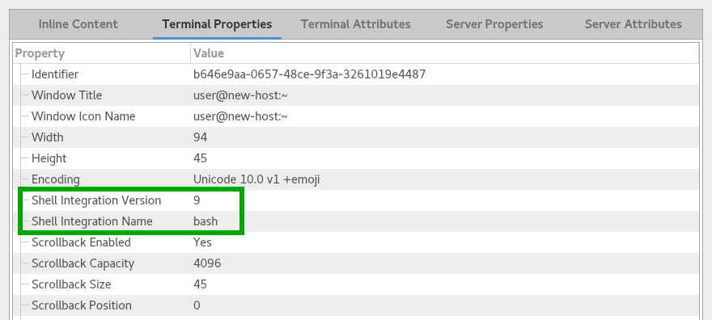

.. Copyright © 2018 TermySequence LLC
.. SPDX-License-Identifier: CC-BY-SA-4.0

Shell Integration
=================

With shell integration, the command shell running within a terminal reports the username, hostname, current directory, and :term:`job` information to :doc:`termy-server <server>` via certain escape sequences. This enables a variety of useful features within :doc:`qtermy <client-qt>` and installing it is highly recommended.

:program:`termy-server` implements the same shell integration escape sequences as the popular `iTerm2 <https://iterm2.com>`_ terminal emulator. The `shell integration scripts <https://www.iterm2.com/documentation-shell-integration.html>`_ provided by that project are compatible with TermySequence.

Installation
------------

If you installed TermySequence via your distribution's package manager, check if shell integration is already installed (see :ref:`shell-integration-verification` below). Otherwise, follow the instructions at `iTerm2 shell integration <https://www.iterm2.com/documentation-shell-integration.html>`_ to install shell integration for your shell. See :ref:`shell-integration-notes` below for shell-specific notes and configuration options.

When using :program:`bash`, make sure not to clobber the :envvar:`PROMPT_COMMAND` environment variable after the shell integration script has been loaded. See :ref:`shell-integration-notes` below.

:program:`termy-server` defines the environment variable :envvar:`TERMYSEQUENCE` within its terminals. Within login scripts, check for this variable before loading or sourcing the shell integration script. This will ensure that it doesn't get loaded by other terminal emulators which might not support the escape sequences. The shell integration scripts distributed with TermySequence do check for this variable.

.. note:: Thanks to the iTerm2 project for providing permission to distribute shell integration scripts with TermySequence.

.. _shell-integration-verification:

Verification
------------

To verify that shell integration is active, open the :doc:`Terminal Information window <dialogs/view-information>` using Terminal→View Terminal Information or by clicking the terminal size in the status bar. Check the "Shell Integration Version" property on the Terminal Properties tab as shown in the :ref:`nearby figure <shell-integration-properties>`. If it is blank, shell integration is not active.

.. _shell-integration-properties:

   Verifying shell integration in the Terminal Information window.

.. _shell-integration-notes:

Notes
-----

Shell-specific notes:

   :program:`bash`
      The :envvar:`PROMPT_COMMAND` environment variable is used to implement :program:`bash` shell integration. When the shell integration script is sourced, any existing prompt command will be preserved and run as normal. This means that :envvar:`PROMPT_COMMAND` should be set before the shell integration script is sourced, not afterward.

      This presents a problem when using the :file:`/etc/profile.d/termy_shell_integration.sh` distributed with TermySequence, because :file:`/etc/profile` is sourced before user login scripts have a chance to run. To set a custom :envvar:`PROMPT_COMMAND` in this scenario, create the file :file:`{$HOME}/.termy_bash_prompt` and set the prompt command from there. The shell integration script sources this file before setting up shell integration. Refer to the top of the script for the implementation details.
