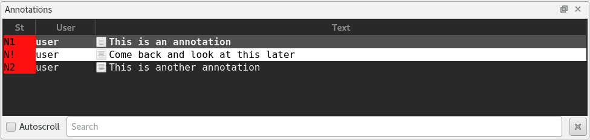

.. Copyright © 2018 TermySequence LLC
.. SPDX-License-Identifier: CC-BY-SA-4.0

Annotations
===========

The Annotations tool displays the :term:`annotations <annotation>` that have been created in terminals using the :doc:`Create Annotation dialog <../dialogs/create-annotation>`. The most recent annotations are displayed at the bottom of the list, which can be set to autoscroll as new annotations are appended (The tool's :termy:action:`search bar <ToolSearch>` contains the autoscroll option). The Annotations tool provides access to convenient note-related :doc:`actions <../actions>`, including:

   * Scrolling to the :termy:action:`start <ScrollRegionStart>` or :termy:action:`end <ScrollRegionEnd>` of an :term:`annotation` within the terminal scrollback.
   * :termy:action:`Copying <CopyJob>` or :termy:action:`selecting <SelectJob>` the annotated text within the terminal scrollback.
   * :termy:action:`Removing <RemoveNote>` an annotation.

Annotations are displayed in the Annotations tool using the same :termy:profile:`colors <Appearance/Palette>` as their parent terminal. The status column uses the same display format as the :ref:`Marks tool <marks-widget>`. The tool's :termy:global:`font <Annotations/AnnotationsFont>` and :termy:global:`capacity <Annotations/AnnotationsSizeLimit>` are configurable under the :ref:`History and Notes Tools <global-history-tool>` category in the :doc:`Global settings <../settings/global>`. Note that these settings are shared with the :doc:`History tool <history>`. Via global settings, certain :doc:`actions <../actions>` can be configured to run on a double-click, Control-click, Shift-click, or middle-click of an annotation.

The Annotations tool is both :ref:`navigable <tools-navigable>` and :termy:action:`searchable <ToolSearch>`, having a current selection that can be moved and acted upon using generic or tool-specific actions. Searches entered into the tool search bar will filter the list of annotations, showing only those annotations whose text matches the search string. Several table columns besides the text and status are available, including the line number, username, hostname, and creation time. Drag table column headers to reorder them and use the header's context menu to show and hide individual columns. If the table header is not visible, show it using Tools→Display or :termy:action:`ToggleToolTableHeader`. Sorting is not supported; annotations are always displayed in chronological order by their creation time.

When an annotation's terminal has been closed or the annotation has scrolled off the top of its terminal's scrollback buffer, the contents of the annotation region will be lost and some tool functions such as :termy:action:`copy <CopyJob>` and :termy:action:`select <SelectJob>` will not be available.

The Annotations tool can be filtered by terminal and server using Tools→Filter, the context menu, or by calling the various :termy:action:`ToolFilter <ToolFilterAddServer>` actions directly. Individual terminals or all terminals belonging to a given :doc:`server <../settings/server>` can be whitelisted or blacklisted using filter actions. Annotations belonging to closed terminals can also be removed from the list using the filter menu or :termy:action:`ToolFilterRemoveClosed`. Note that the tool filter is shared between the :doc:`History <history>`, Annotations, and :doc:`Tasks <tasks>` tools.

The :ref:`nearby figure <annotations-tool-example>` shows the Annotations tool in a typical situation. Annotations from two terminals are visible: one using a light-background :doc:`theme <../settings/theme>` and one using a dark-background theme. The first annotation in the list is selected. The second annotation has been given an exclamation mark as its :doc:`note character <../dialogs/create-annotation>` rather than the default number.

.. _annotations-tool-example:

   Example of a typical Annotations tool with a selected annotation.
