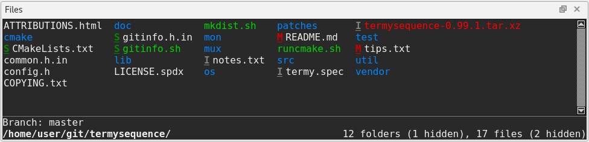
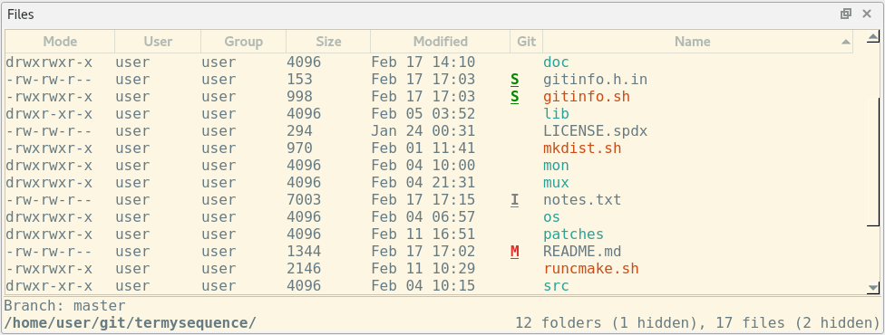

.. Copyright © 2018 TermySequence LLC
.. SPDX-License-Identifier: CC-BY-SA-4.0

Files
=====

The Files tool displays the files in the :term:`active terminal`'s current directory, as reported by :doc:`termy-server <../server>`. The Files tool also displays the current directory itself, a count of files and directories, the name of the selected file (if any), and optional git information in a "banner" line at the bottom of the tool. If the :termy:profile:`FileColorize <Files/FileColorize>` profile setting is enabled, filenames are shown using the configured :termy:profile:`Dircolors <Files/Dircolors>`. If :termy:profile:`FileGittify <Files/FileGittify>` is enabled, git status information for each file will be shown as a character whose color can be customized using :ref:`extended dircolors <dircolors-editor-extended>`. Note that :doc:`termy-server <../server>` must have libgit2 support enabled for git status information to be reported.

The Files tool provides access to filesystem actions such as :termy:action:`download <DownloadFile>`, :termy:action:`upload <UploadFile>`, :termy:action:`open <OpenFile>`, :termy:action:`delete <DeleteFile>`, :termy:action:`rename <RenameFile>`, and more. Through the TermySequence protocol, these file operations work regardless of whether the :term:`active terminal` is on a :term:`local <local server>` or remote server, and regardless of how many hops separate your machine from the server. It's even possible to :termy:action:`mount <MountFile>` remote files using FUSE and edit them directly using local desktop applications. Install :doc:`termy-server <../server>` in your containers and on your remote servers; you won't miss typing in :manpage:`scp(1)` commands from scratch.

Files are displayed in :program:`ls`-like format; either short or long, depending on the :termy:profile:`FileDisplayFormat <Files/FileDisplayFormat>` profile setting. The display format can be changed from the context menu or Tools menu or by calling :termy:action:`SetFileListingFormat` or :termy:action:`ToggleFileListingFormat`. Further settings for the Files tool are located under the :ref:`Files/Files Tool <global-files-tool>` category in the :doc:`Global settings <../settings/global>` and under the :ref:`Files <profile-files>` category in the :doc:`Profile settings <../settings/profile>`.  Via global settings, certain :doc:`actions <../actions>` can be configured to run on a double-click, Control-click, Shift-click, or middle-click of a file.

.. caution:: The Files tool does not work across plain :manpage:`ssh(1)` connections made directly from the command line. In this case, the current directory of the SSH client itself will be shown, not the current directory on the remote server. :program:`qtermy` will attempt to detect this condition by matching the hostname reported by :doc:`shell integration <../shell-integration>` with the hostname of the terminal's :doc:`server <../settings/server>`. For best results, install :doc:`termy-server <../server>` on remote machines and use TermySequence :doc:`connections <../settings/connection>`.

The Files tool is both :ref:`navigable <tools-navigable>` and :termy:action:`searchable <ToolSearch>`, having a current selection that can be moved and acted upon using generic or tool-specific actions. Searches entered into the tool search bar will filter the list of files, showing only those files whose names match the search string. Files can be sorted in ascending or descending order by name, size, modification time, and several other fields from the context menu or Tools menu, or by calling :termy:action:`SetFileListingSort`. In long format only, click a table column header to sort, drag table column headers to reorder them, and use the header's context menu to show and hide individual columns. If the table header is not visible, show it using Tools→Display or :termy:action:`ToggleToolTableHeader`.

:doc:`termy-server <../server>` and :program:`qtermy` support `OSC 8 hyperlinks <https://gist.github.com/egmontkob/eb114294efbcd5adb1944c9f3cb5feda>`_, which can be produced by recent versions of GNU :program:`ls` using the ``--hyperlink`` argument. For versions of :program:`ls` without hyperlink support, the LsPlugin :doc:`semantic parser plugin <../plugins/parser>` distributed with :program:`qtermy` creates :term:`semantic regions <semantic region>` having the same effect. Both of these solutions provide access to the same file actions as the Files tool directly within the terminal viewport itself.

If a file has been selected either within the Files tool or by clicking a :term:`semantic region` with an associated ``file://`` URL, it will be shown in the banner line alongside or in place of the current directory. The Files tool can be :termy:global:`configured <Files/AutoRaiseFiles>` to autoraise itself when the selected file changes. Any semantic region within the terminal viewport whose URL matches the selected file in the Files tool will be displayed with a "selected" border.

.. note:: It's possible for the selected file in the Files tool to be located outside of the active terminal's current directory. This can occur when clicking on a :term:`semantic region` with a ``file://`` URL. When this happens, the notation "*not in cwd*" will be displayed in the banner line.

The nearby figures show the Files tool in a typical situation. In the :ref:`first figure <files-tool-example-short>`, a git working tree is shown in short display format using the Default Dark :doc:`theme <../settings/theme>`. Note the git status characters displayed next to some files which are modified, staged, or ignored. In the :ref:`second figure <files-tool-example-long>`, the same directory is shown in long display format using the Solarized Light :doc:`theme <../settings/theme>`.

.. _files-tool-example-short:

   Example of a typical Files tool in short display format with git status information.

.. _files-tool-example-long:

   Example of a typical Files tool in long display format with git status information.

If a mouse click type is configured in the :ref:`Global settings <global-files-tool>` to "*Open file or write cd command to terminal*," a :program:`cd` command will be written to the terminal if a directory is clicked within the Files tool, including pathname components shown in the banner area. By default, this feature is set as the action for double-click (your :doc:`Global settings <../settings/global>` may differ) and allows directory navigation to be performed without typing :program:`cd` commands. Note that this feature does not apply to :term:`semantic regions <semantic region>` within the terminal viewport itself.

To ensure reasonable performance, :doc:`termy-server <../server>`'s directory monitor has a size limit configurable via the :termy:profile:`DirectorySizeLimit <Files/DirectorySizeLimit>` profile setting. If the number of files in the current directory exceeds this limit, the Files tool will display a message allowing the limit to be raised on a case-by-case basis.

Changes to individual files may be reported by the server if it supports filesystem event monitoring (on Linux, :manpage:`inotify(7)` is used for this purpose). If the :termy:profile:`FileChangeEffect <Files/FileChangeEffect>` profile setting is enabled, a brief animation will be displayed in the Files tool when a change notification is received for a file. Removal notifications are also supported; they will cause files to be removed from the list.
