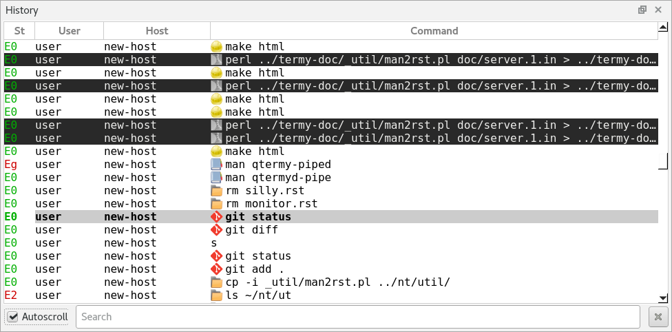

.. Copyright © 2018 TermySequence LLC
.. SPDX-License-Identifier: CC-BY-SA-4.0

History
=======

The History tool displays the :term:`jobs <job>` reported by :doc:`shell integration <../shell-integration>` that have been run in each terminal. The most recent jobs are displayed at the bottom of the list, which can be set to autoscroll as new jobs are appended (The tool's :termy:action:`search bar <ToolSearch>` contains the autoscroll option). The History tool provides access to convenient job-related :doc:`actions <../actions>`, including:

   * Scrolling to the :termy:action:`start <ScrollRegionStart>` or :termy:action:`end <ScrollRegionEnd>` of a :term:`job` within the terminal scrollback.
   * :termy:action:`Copying <CopyJob>` or :termy:action:`selecting <SelectJob>` the entire text of the job or just the command or output portions.
   * Writing a command to the :term:`active terminal`, either :termy:action:`with <WriteCommandNewline>` or :termy:action:`without <WriteCommand>` a trailing newline.
   * :termy:action:`Annotating <AnnotateRegion>` a job.

Jobs are displayed in the History tool using the same :termy:profile:`colors <Appearance/Palette>` as their parent terminal. The icon displayed with each job is derived by matching its command against the :doc:`icon autoswitch rules <../dialogs/icon-rule-editor>` that reference the ``proc.comm`` attribute. The exit status column uses the same display format as the :ref:`Marks tool <marks-widget>`. The tool's :termy:global:`font <History/HistoryFont>` and :termy:global:`capacity <History/HistorySizeLimit>` are configurable under the :ref:`History and Notes Tools <global-history-tool>` category in the :doc:`Global settings <../settings/global>`. Via global settings, certain :doc:`actions <../actions>` can be configured to run on a double-click, Control-click, Shift-click, or middle-click of a job.

The History tool is both :ref:`navigable <tools-navigable>` and :termy:action:`searchable <ToolSearch>`, having a current selection that can be moved and acted upon using generic or tool-specific actions. Searches entered into the tool search bar will filter the list of jobs, showing only those jobs whose commands match the search string. Several table columns besides the command text and exit status are available, including the line number, username, hostname, directory, start time, and duration. Drag table column headers to reorder them and use the header's context menu to show and hide individual columns. If the table header is not visible, show it using Tools→Display or :termy:action:`ToggleToolTableHeader`. Sorting is not supported; jobs are always displayed in chronological order by their start time.

Each :term:`job` will be added to the History tool as soon as it is reported by :doc:`shell integration <../shell-integration>`. When the exit status of the job is reported, the job will be updated and a brief animation will be shown. When a job's terminal has been closed or the job has scrolled off the top of its terminal's scrollback buffer, the contents of the job region will be lost and some tool functions such as :termy:action:`copy <CopyJob>` and :termy:action:`select <SelectJob>` will not be available.

The History tool can be filtered by terminal and server using Tools→Filter, the context menu, or by calling the various :termy:action:`ToolFilter <ToolFilterAddServer>` actions directly. Individual terminals or all terminals belonging to a given :doc:`server <../settings/server>` can be whitelisted or blacklisted using filter actions. Jobs belonging to closed terminals can also be removed from the list using the filter menu or :termy:action:`ToolFilterRemoveClosed`. Note that the tool filter is shared between the History, :doc:`Annotations <annotations>`, and :doc:`Tasks <tasks>` tools.

The :ref:`nearby figure <history-tool-example>` shows the History tool in a typical situation. Jobs from two terminals are visible: one using a light-background :doc:`theme <../settings/theme>` and one using a dark-background theme. The job with the command string :command:`git status` is selected.

.. _history-tool-example:

   Example of a typical History tool with a selected job.
