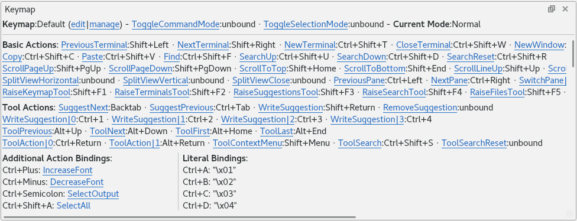
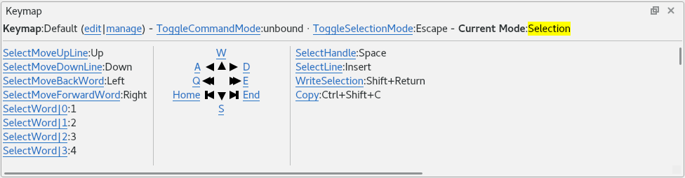

.. Copyright © 2018 TermySequence LLC
.. SPDX-License-Identifier: CC-BY-SA-4.0

Keymap
======

The :doc:`Keymap Tool <../tools/keymap>` displays a list of key bindings defined by the :doc:`keymap <../settings/keymap>` in the :term:`active terminal`. Use the Keymap tool as a learning aide and quick reference for the mostly commonly used key bindings. Or, scroll down in the tool to see a complete list of bindings for both :doc:`actions <../actions>` and literals. :ref:`Action bindings <keymap-action>` shown in the tool can be clicked with the mouse to invoke the corresponding :doc:`action <../actions>` just as if the bound key was pressed. Bindings shown in the tool will also animate briefly when the corresponding key is pressed. Right click on an action binding to get a context menu which links directly to the :doc:`documentation <../actions>` for the action.

The Keymap tool is not :termy:action:`searchable <ToolSearch>` and is never the :doc:`active tool <index>`. The tool will respond to :ref:`command mode <keymap-modes>` and :ref:`selection mode <keymap-modes>` by displaying the applicable bindings for the active mode. The Keymap tool can be :termy:global:`configured <Command/RaiseKeymapInCommandMode>` to autoraise itself whenever command mode or selection mode become active. The :doc:`global settings <../settings/global>` to accomplish this are located under the :ref:`Command/Selection Mode <global-command-mode>` category. The :termy:action:`RaiseKeymapTool` action is bound to Shift+F1 in :program:`qtermy`'s compiled-in default keymap (your keymap may differ).

On the top line of the tool, the name of the active keymap is shown along with links to :termy:action:`edit <EditKeymap>` and :termy:action:`manage <ManageKeymaps>` it. Also shown on the top line are the bindings for :termy:action:`ToggleCommandMode` and :termy:action:`ToggleSelectionMode`, which can be clicked to invoke them. Finally, the current mode is shown: one of "Normal", "Command", "Selection", or "Command+Selection". This top line will remain visible no matter which mode is active.

The :ref:`first nearby figure <keymap-tool-example-normal>` shows the Keymap tool in its normal mode. Beneath the top line is a list of the most commonly used :ref:`action bindings <keymap-action>`. This list is organized into Basic and Tool actions. Further down is a list of additional action and literal bindings which are not :ref:`conditioned <keymap-modes>` on command or selection mode.

.. _keymap-tool-example-normal:

   The Keymap tool in normal mode, showing a typical keymap.

The :ref:`second nearby figure <keymap-tool-example-selection>` shows the Keymap tool with selection mode active. Action bindings conditioned on and intended to be used in selection mode are arranged in a fixed layout.

.. _keymap-tool-example-selection:

   The Keymap tool in selection mode, showing a typical keymap.

When command mode is active, the Keymap tool displays action and literal bindings which are :ref:`conditioned <keymap-modes>` on command mode. The Keymap tool in this mode appears similar to its normal mode but without the list of commonly used action bindings.
