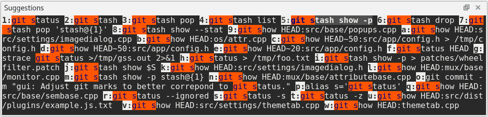

.. Copyright © 2018 TermySequence LLC
.. SPDX-License-Identifier: CC-BY-SA-4.0

Suggestions
===========

The Suggestions tool displays a list of commands from the :ref:`command history database <suggestions-database>` which match the characters entered at the current shell prompt. The recording of command history and the detection of the current shell prompt both require :doc:`shell integration <../shell-integration>` to be installed. Commands suggested by the tool can be copied to the clipboard or written to the shell prompt using the context menu or by calling certain :doc:`actions <../actions>` listed below. The Suggestions tool is capable of matching commands:

   * By substring, either at the beginning of the command or anywhere within it.
   * By acronym, using the first alphanumeric character of each word in the command.

For example, the command "``echo Hello, World!``" will match against ``echo H`` (a prefix), ``World`` (a substring), or ``eHW`` (an acronym).

The Suggestions tool is not :termy:action:`searchable <ToolSearch>` but it is :ref:`navigable <tools-navigable>`, having a current selection that can be moved and acted upon using generic or tool-specific actions. Via global settings, certain :doc:`actions <../actions>` can be configured to run on a double-click, Control-click, Shift-click, or middle-click of a suggestion. Further :doc:`global settings <../settings/global>` for the tool are located under the :ref:`Suggestions Tool <global-suggestions-tool>` category.

The Suggestions tool can be :termy:global:`configured <Suggestions/AutoRaiseSuggestions>` to autoraise itself when suggested commands are available. A small number of characters need to be typed at the shell prompt before the Suggestions tool will display any suggestions.  Additionally, a configurable brief :termy:global:`idle period <Suggestions/SuggestionsDelayTime>` must pass before the Suggestions tool will autoraise, unless there is a unique suggestion for the characters that have been typed. This prevents the tool from popping up and flickering rapidly while a command is still being typed out.

Some commonly used actions with bindings in :program:`qtermy`'s compiled-in default keymap (your keymap may differ) are:

   * :termy:action:`RaiseSuggestionsTool` (Shift+F3)
   * :termy:action:`SuggestNext` (Shift+Tab, referred to as "Backtab" by Qt)
   * :termy:action:`SuggestPrevious` (Ctrl+Tab)
   * :termy:action:`WriteSuggestion` (Shift+Return): Writes the selected suggestion to the terminal, or the first suggestion if no suggestion is selected
   * :termy:action:`WriteSuggestion|0 <WriteSuggestion>` (Ctrl+1): Writes the first suggestion to the terminal
   * :termy:action:`WriteSuggestion|1 <WriteSuggestion>` (Ctrl+2): Writes the second suggestion to the terminal
   * :termy:action:`WriteSuggestion|2 <WriteSuggestion>` (Ctrl+3): Writes the third suggestion to the terminal
   * :termy:action:`WriteSuggestion|3 <WriteSuggestion>` (Ctrl+4): Writes the fourth suggestion to the terminal
   * :termy:action:`ToolAction|0 <ToolAction>` (Ctrl+Return): Same as double-click; runs :termy:action:`WriteSuggestion` by default. Your :termy:global:`TasksAction0 <Tasks/TasksAction0>` global setting may differ.
   * :termy:action:`ToolAction|1 <ToolAction>` (Alt+Return): Same as Control-click; runs :termy:action:`RemoveSuggestion` by default, which removes the selected suggestion from the :ref:`command history database <suggestions-database>`. Your :termy:global:`TasksAction1 <Tasks/TasksAction1>` global setting may differ.

The :ref:`nearby figure <suggestions-tool-example>` shows the Suggestions tool in a typical situation. The characters ``git s`` have been typed at the terminal's command prompt. Many suggested commands are displayed; the fifth suggestion has been selected using :termy:action:`SuggestNext` and is ready to write to the terminal using :termy:action:`WriteSuggestion`.

.. _suggestions-tool-example:

   Example of a typical Suggestions tool with a selected suggestion.

Commands are ordered using a frecency score that ranks each command based on how many times it has been run and how recently it was last run. However, there is an exception: if the characters typed at the prompt were previously autocompleted to a given command using :termy:action:`WriteSuggestion`, those characters are considered an `alias` for the command and it will be ordered first in the suggestions list regardless of frecency score and and marked with an asterisk (*).

.. note:: Commands are not stored in the database until an exit status is reported by :doc:`shell integration <../shell-integration>`. A command still in the running state won't be shown in the Suggestions tool unless it was previously stored in the database.

.. _suggestions-database:

The database of commands used by the Suggestions tool is stored in :file:`{$HOME}/.cache/qtermy/history.sqlite3`. This is a SQLite database file that can be opened using any SQLite database editor such as `DB4S <http://sqlitebrowser.org/>`_ or programmatically using `SQLite <https://sqlite.org/>`_ itself. In brief, the tables stored in the database are:

   command
      The main history table. Stores commands, command acronyms (used for first-letter-of-word matching rather than prefix matching), frecency score, and metadata.

   alias
      The aliases table. Stores the prefixes and acronyms that have been autocompleted to commands.

   exclusions
      A list of ECMAScript regular expressions that specify commands to exclude from the database. If a command matches one of these regular expressions, it won't be saved in the database. This table is empty by default. Note that adding a new regular expression to the table won't remove commands already saved in the database.
