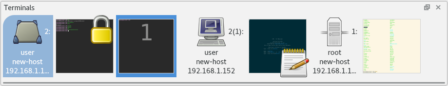

.. Copyright © 2018 TermySequence LLC
.. SPDX-License-Identifier: CC-BY-SA-4.0

Terminals
=========

The Terminals tool displays an ordered list of thumbnails for each currently connected server and terminal. The terminals belonging to each server always appear immediately after it in the ordering, otherwise servers and terminals can be reordered at will. Terminals can also be hidden, in which case their thumbnails do not appear in the list. Server thumbnails are never hidden.

The Terminals tool is not :termy:action:`searchable <ToolSearch>` and is never the :doc:`active tool <index>`. Within the tool, the thumbnails belonging to the :term:`active terminal` and :term:`active server` are highlighted in a different color. The Terminals tool can be :termy:global:`configured <Appearance/AutoRaiseTerminals>` to autoraise itself whenever the active terminal or active server changes. Further :doc:`global settings <../settings/global>` for the tool are located under the :ref:`Appearance/Terminals Tool <global-terminals-tool>` category, but many :doc:`settings <../settings/index>` throughout the application affect the Terminals tool in some way. Via global settings, nearly any :doc:`action <../actions>` can be configured to run on a double-click, Control-click, Shift-click, or middle-click of a thumbnail.

Some commonly used actions with bindings in :program:`qtermy`'s compiled-in default keymap (your keymap may differ) are:

   * :termy:action:`RaiseTerminalsTool` (Shift+F2)
   * :termy:action:`PreviousTerminal` (Shift+Left)
   * :termy:action:`NextTerminal` (Shift+Right)

The captions displayed on thumbnails, as well as their tooltips, are configurable via global settings. The icon image displayed in server thumbnails is normally derived from the ``icon`` server :term:`attribute` but can be set to a fixed icon in the :doc:`Server settings <../settings/server>` for the server or by using Server→Set Icon. The icon image displayed in terminal thumbnails is normally derived from the :doc:`icon autoswitch rules <../dialogs/icon-rule-editor>` but can be set to a fixed icon in the :doc:`Profile settings <../settings/profile>` or by using Terminal→Set Icon. Additional "indicator" icons may be shown in the terminal thumbnail depending on the state of the terminal.

.. _terminals-tool-example:

   Example of a typical Terminals tool with three servers connected.

The :ref:`nearby figure <terminals-tool-example>` shows the Terminals tool in a typical situation. The first thumbnail is the server thumbnail for the :term:`transient local server`, displayed with a "desktop" icon to indicate that the server runs within the same desktop session as :program:`qtermy`. The next two thumbnails are terminals that belong to the transient local server, one of which is the :term:`active terminal`, other of which has scroll lock enabled. Next is the server thumbnail for the :term:`persistent user server` followed by one terminal thumbnail in which a text editor is running. Note that the persistent user server has a second terminal which is currently hidden; this is indicated by the number in parentheses on the server thumbnail. Finally, a third server connection has been established to the root user's persistent user server, which has one terminal running on it.

The :doc:`Manage Terminals window <../dialogs/manage-terminals>` provides another view of the same information displayed in the Terminals tool.

Thumbnails can be dragged with the mouse to reorder them, but note that terminals must always go after their parent server. Dragging a thumbnail to a text editor or onto a terminal viewport will paste the UUID of the server or terminal. Dropping text onto a terminal thumbnail will paste the text into the terminal. Dropping a ``file://`` URL onto a thumbnail will either paste the text of the URL or upload the file itself to the server. Configure this behavior using :termy:global:`ServerFileDrop <Files/ServerFileDrop>`, :termy:global:`TerminalLocalFileDrop <Files/TerminalLocalFileDrop>`, and related settings.
